# Architecture Diagrams - Casino Card Game Application

This document contains comprehensive architecture diagrams for the Casino Card Game Application, including component hierarchy, data flow, WebSocket communication, and database schema visualizations.

## Table of Contents

1. [Component Hierarchy Diagram](#component-hierarchy-diagram)
2. [Data Flow Diagram](#data-flow-diagram)
3. [WebSocket Communication Flow](#websocket-communication-flow)
4. [Database Schema Diagram](#database-schema-diagram)
5. [State Management Flow](#state-management-flow)
6. [Deployment Architecture](#deployment-architecture)

---

## Component Hierarchy Diagram

### Frontend Component Tree

```mermaid
graph TD
    A[App.tsx - Root Component] --> B[SoundSystem]
    A --> C[Decor]
    A --> D[GameSettings Modal]
    A --> E[Statistics Display]
    A --> F[Error Display]
    A --> G{Connection State Router}
    
    G -->|Not Connected| H[RoomManager]
    H --> H1[Create Room Form]
    H --> H2[Join Room Form]
    H --> H3[Join Random Button]
    
    G -->|Connected - Waiting/Dealer| I[CasinoRoomView]
    I --> I1[Player Avatars]
    I --> I2[Ready Status Indicators]
    I --> I3[Ready/Not Ready Buttons]
    I --> I4[Shuffle Button]
    I --> I5[Room Code Display]
    
    G -->|Connected - Round1/Round2| J[PokerTableView]
    J --> J1[Dealer Component]
    J --> J2[PlayerHand - Current Player]
    J --> J3[PlayerHand - Opponent]
    J --> J4[Table Cards Display]
    J --> J5[Builds Display]
    J --> J6[Captured Piles Display]
    J --> J7[GameActions Component]
    J --> J8[Score Display]
    J --> J9[Turn Indicator]
    J --> J10[Leave Game Button]
    
    J7 --> J7A[Capture Button]
    J7 --> J7B[Build Button]
    J7 --> J7C[Trail Button]
    J7 --> J7D[GameHints]
    
    J2 --> K[Card Components]
    J3 --> K
    J4 --> K
    J5 --> K
    J6 --> K
    
    G -->|Connected - Other Phases| L[GamePhases]
    L --> L1[CardSelection Phase UI]
    L --> L2[Dealing Phase UI]
    L --> L3[Finished Phase UI]
    L --> L4[Reset Button]
    
    D --> M[Settings Controls]
    M --> M1[Sound Toggle]
    M --> M2[Volume Slider]
    M --> M3[Hints Toggle]
    M --> M4[Statistics Toggle]
    
    style A fill:#FFD700,stroke:#333,stroke-width:3px
    style G fill:#90EE90,stroke:#333,stroke-width:2px
    style J fill:#87CEEB,stroke:#333,stroke-width:2px
```

### Custom Hooks Architecture

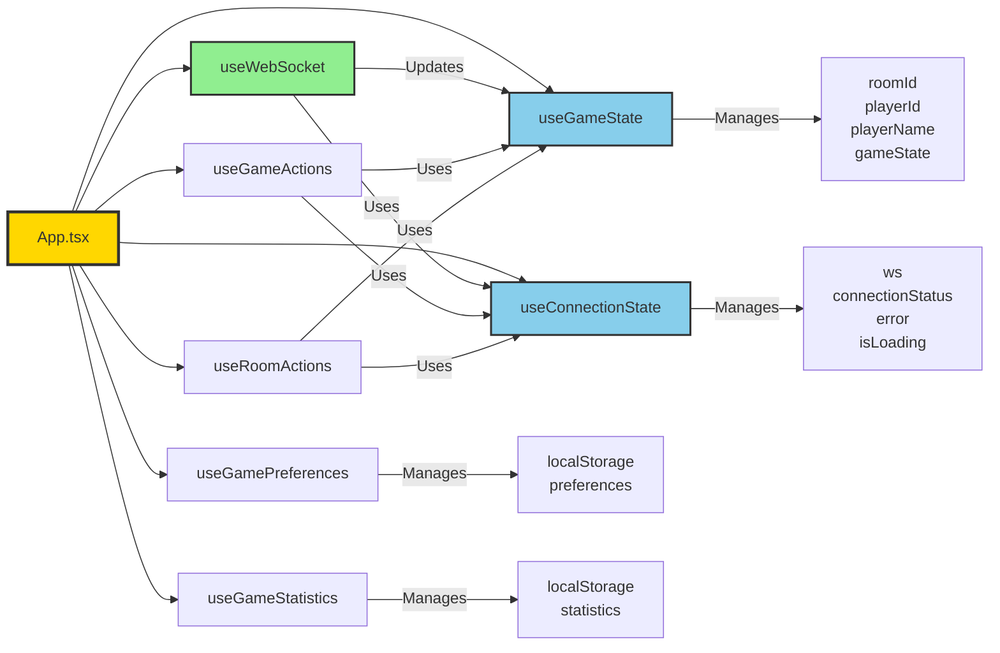

---

## Data Flow Diagram

### Complete User Action Flow

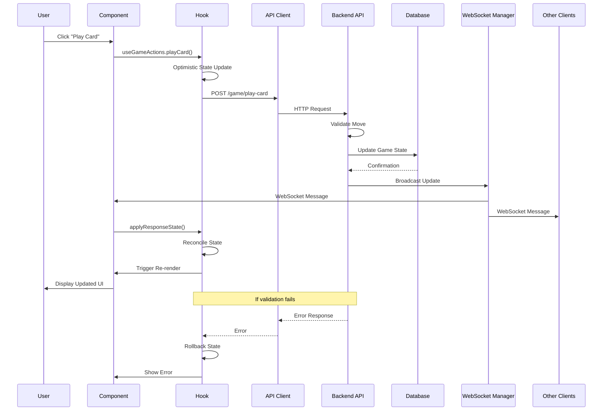

### Room Creation and Joining Flow

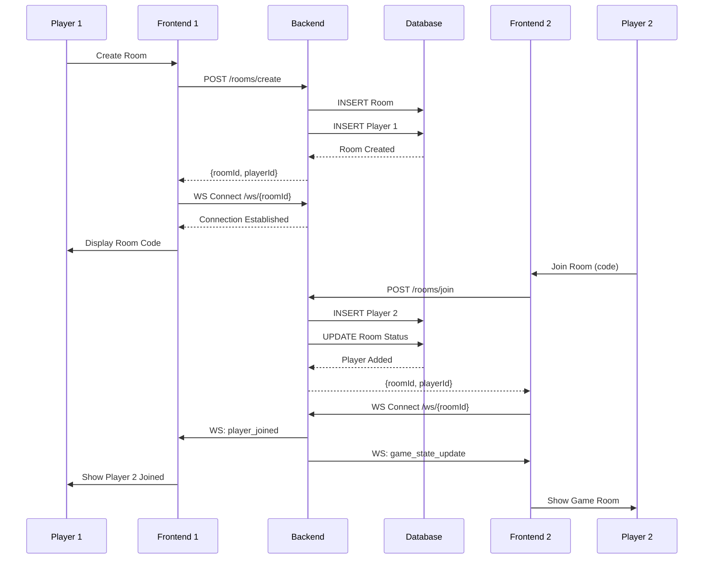

### Game State Synchronization Flow

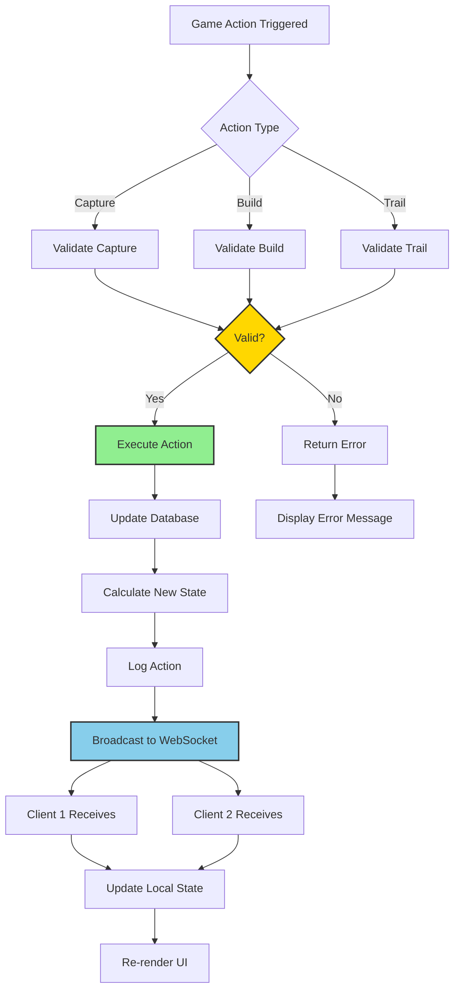

---

## WebSocket Communication Flow

### WebSocket Connection Lifecycle

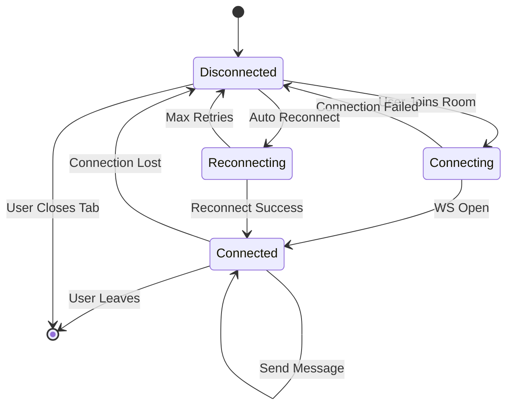

### WebSocket Message Types

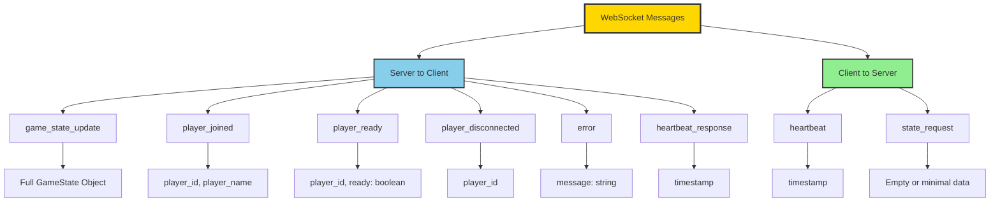

### Reconnection Strategy

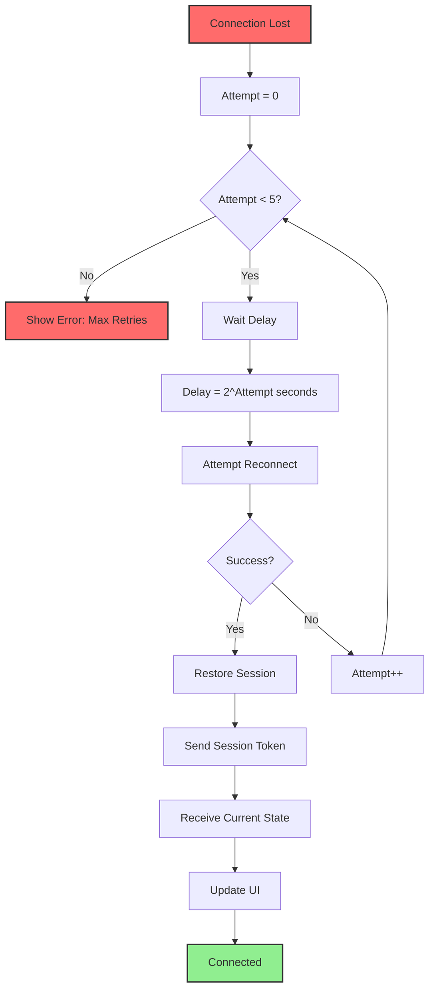

### Session Management Flow

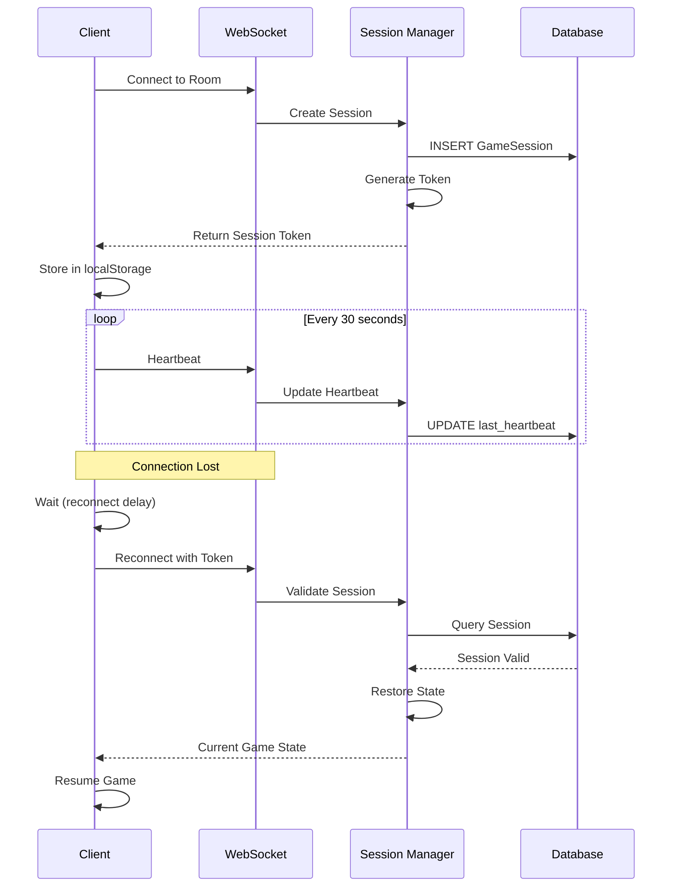

---

## Database Schema Diagram

### Entity Relationship Diagram

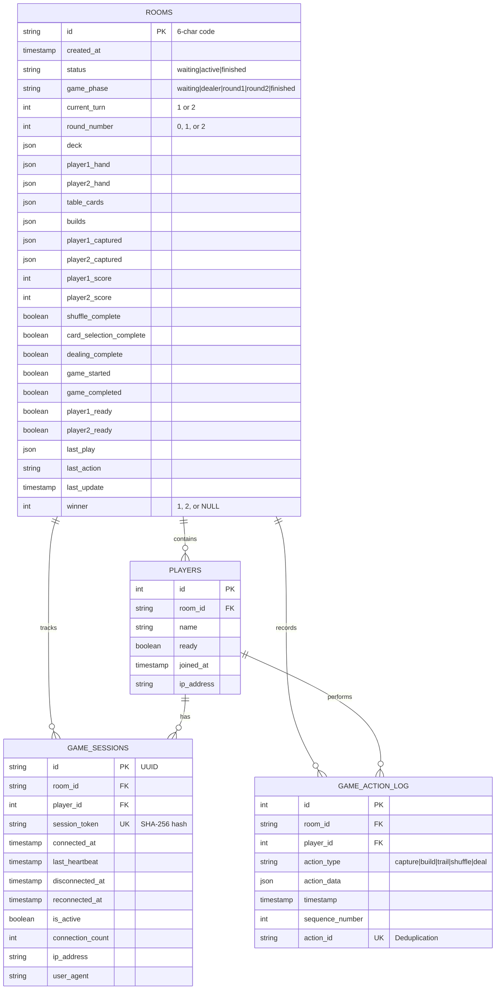

### Database Indexes

```mermaid
graph TD
    A[Database Indexes] --> B[ROOMS Table]
    A --> C[PLAYERS Table]
    A --> D[GAME_SESSIONS Table]
    A --> E[GAME_ACTION_LOG Table]
    
    B --> B1[PRIMARY: id]
    B --> B2[INDEX: status]
    B --> B3[INDEX: game_phase]
    B --> B4[INDEX: last_update]
    
    C --> C1[PRIMARY: id]
    C --> C2[INDEX: room_id]
    C --> C3[INDEX: joined_at]
    
    D --> D1[PRIMARY: id]
    D --> D2[UNIQUE: session_token]
    D --> D3[INDEX: room_id]
    D --> D4[INDEX: player_id]
    D --> D5[INDEX: is_active]
    D --> D6[INDEX: last_heartbeat]
    
    E --> E1[PRIMARY: id]
    E --> E2[UNIQUE: action_id]
    E --> E3[INDEX: room_id]
    E --> E4[INDEX: player_id]
    E --> E5[INDEX: timestamp]
    E --> E6[INDEX: sequence_number]
    
    style A fill:#FFD700,stroke:#333,stroke-width:3px
```

---

## State Management Flow

### Frontend State Architecture

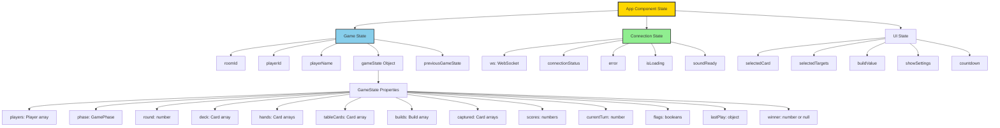

### State Update Patterns

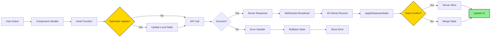

---

## Deployment Architecture

### Production Infrastructure

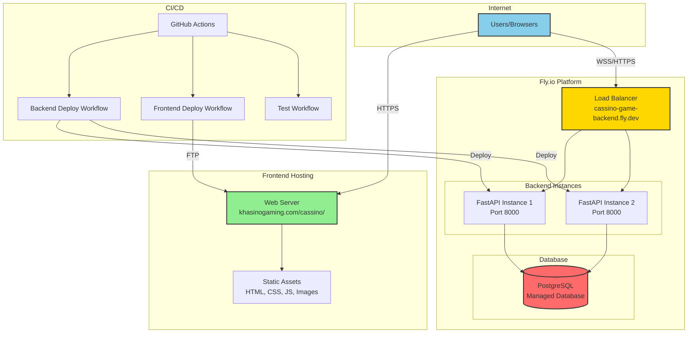

### Request Flow in Production

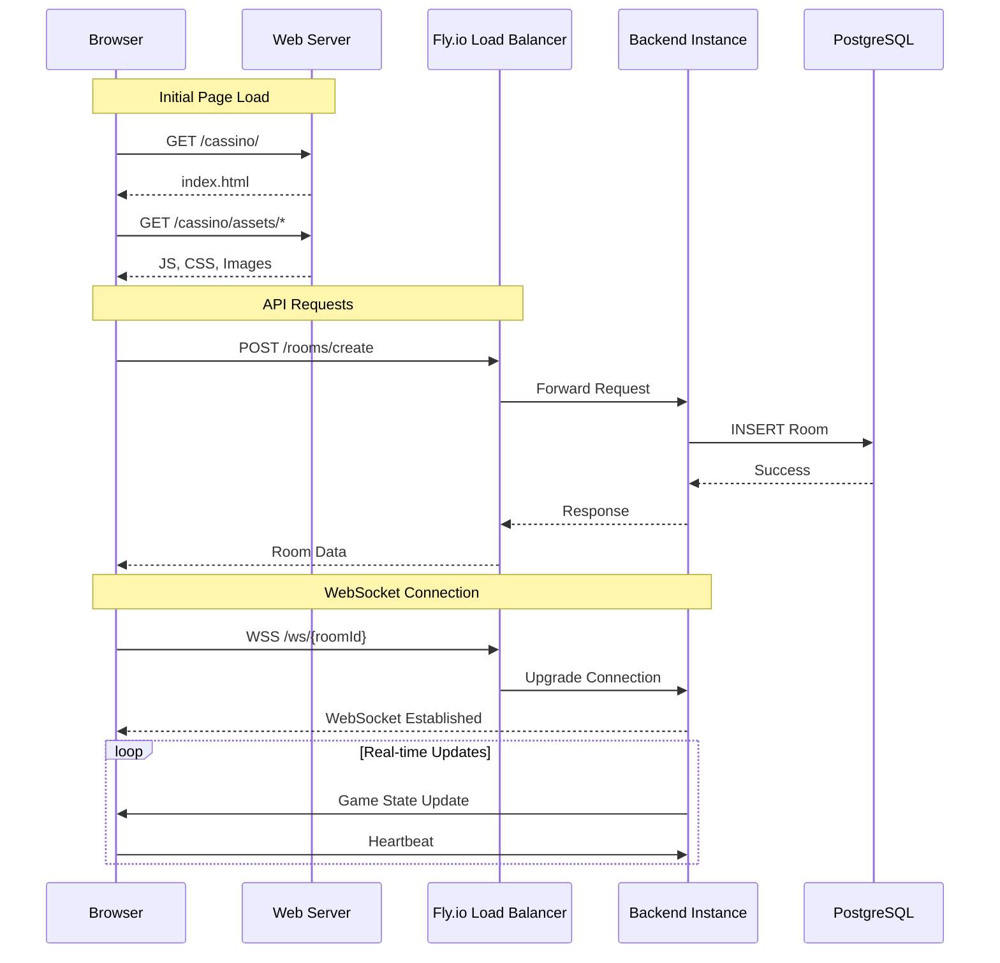

### Environment Configuration

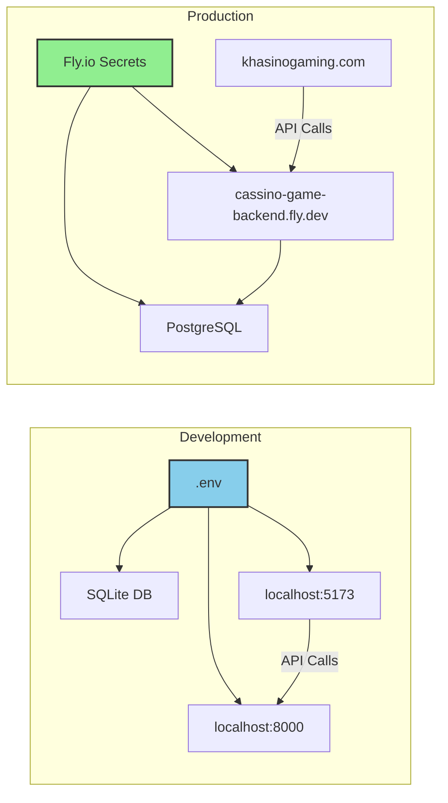

---

## Summary

These architecture diagrams provide a comprehensive visual representation of the Casino Card Game Application's structure, including:

1. **Component Hierarchy**: Shows the React component tree and custom hooks architecture
2. **Data Flow**: Illustrates how data moves through the system from user actions to UI updates
3. **WebSocket Communication**: Details the real-time communication patterns and reconnection logic
4. **Database Schema**: Visualizes the entity relationships and indexing strategy
5. **State Management**: Explains how state is managed and synchronized across the application
6. **Deployment Architecture**: Shows the production infrastructure and request flow

These diagrams serve as essential documentation for understanding the system architecture, onboarding new developers, and planning future enhancements.
