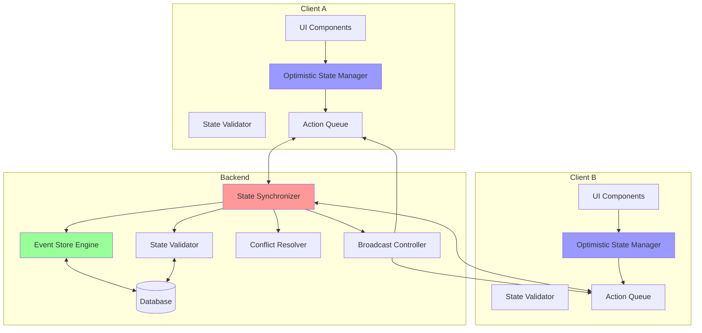
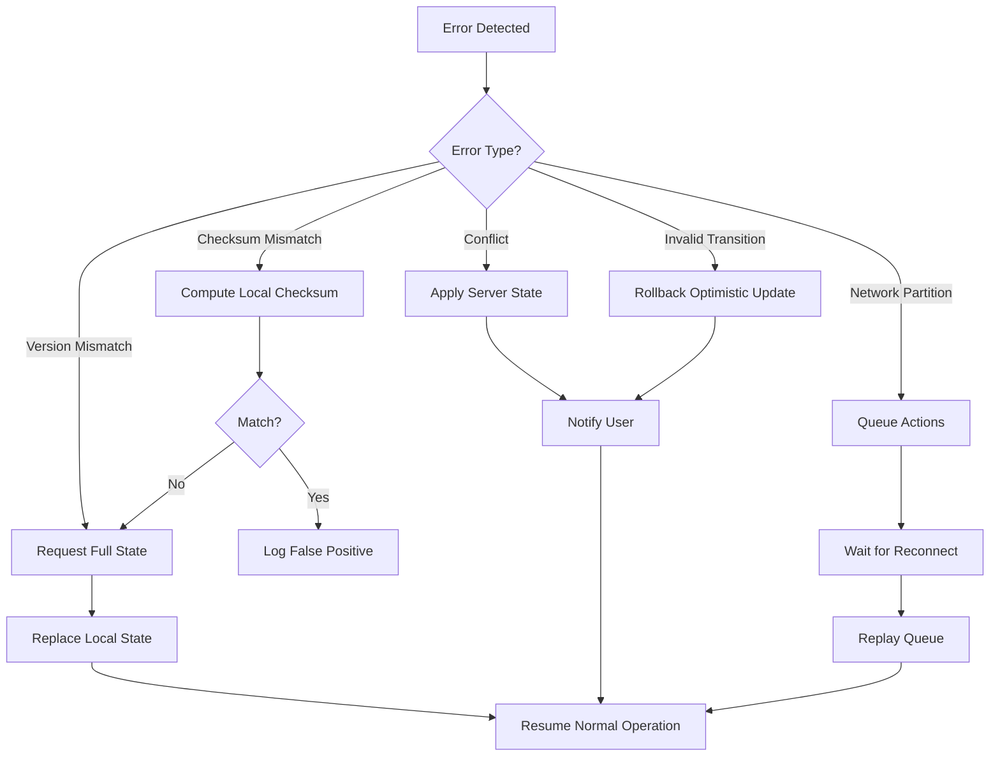

# Design Document: Game State Synchronization

## Overview

This design document outlines the architecture for implementing robust game state synchronization in the Casino Card Game. The solution addresses current limitations where frontend and backend states can diverge, leading to inconsistent game views, duplicate actions, and potential exploits.

The design implements a multi-layered synchronization strategy:
1. **Version-Based Tracking** - Every state change gets a version number
2. **Optimistic Updates** - Immediate local updates with server confirmation
3. **Event Sourcing** - All actions stored as immutable events
4. **Conflict Resolution** - Server-authoritative conflict handling
5. **Real-Time Broadcasting** - Sub-200ms state propagation

### Design Goals

- Ensure all players see identical game state at all times
- Provide responsive UI through optimistic updates
- Handle concurrent actions gracefully
- Prevent cheating through server-side validation
- Enable state recovery and replay
- Minimize network bandwidth usage
- Maintain sub-second synchronization latency

### Non-Goals

- P2P state synchronization (server remains authoritative)
- Offline gameplay support
- Cross-game state sharing
- Historical game analytics (separate concern)

## Architecture

### High-Level Architecture




### State Flow Sequence

1. **Player Action**: UI → Optimistic State Manager → Action Queue
2. **Optimistic Update**: Local state updated immediately
3. **Server Validation**: Action Queue → State Synchronizer → State Validator
4. **Event Storage**: State Validator → Event Store Engine → Database
5. **Broadcast**: State Synchronizer → Broadcast Controller → All Clients
6. **Confirmation**: Clients receive update → Validate version → Apply or rollback


## Components and Interfaces

### 1. Frontend: Optimistic State Manager

**Location**: `hooks/useOptimisticState.ts`

**Responsibilities**:
- Apply optimistic updates immediately
- Track pending confirmations
- Rollback rejected updates
- Manage local state version

**Interface**:
```typescript
interface OptimisticStateManager {
  // State
  localState: GameState
  pendingActions: PendingAction[]
  stateVersion: number
  
  // Methods
  applyOptimistic(action: GameAction): void
  confirmAction(actionId: string, serverState: GameState): void
  rejectAction(actionId: string, reason: string): void
  rollbackTo(version: number): void
  
  // Callbacks
  onOptimisticApplied: (action: GameAction) => void
  onActionConfirmed: (actionId: string) => void
  onActionRejected: (actionId: string, reason: string) => void
}

interface PendingAction {
  id: string
  action: GameAction
  localVersion: number
  timestamp: number
  status: 'pending' | 'confirmed' | 'rejected'
}
```

**Optimistic Update Algorithm**:
```typescript
function applyOptimistic(action: GameAction) {
  // 1. Generate unique action ID
  const actionId = generateActionId()
  
  // 2. Apply action to local state
  const newState = applyActionToState(localState, action)
  
  // 3. Increment local version
  const newVersion = stateVersion + 1
  
  // 4. Store as pending
  pendingActions.push({
    id: actionId,
    action,
    localVersion: newVersion,
    timestamp: Date.now(),
    status: 'pending'
  })
  
  // 5. Update UI immediately
  setLocalState(newState)
  setStateVersion(newVersion)
  
  // 6. Send to server
  sendToServer(actionId, action)
}
```


### 2. Frontend: State Validator

**Location**: `utils/stateValidator.ts`

**Responsibilities**:
- Validate state transitions locally
- Compute state checksums
- Detect desync conditions
- Verify game rules compliance

**Interface**:
```typescript
interface StateValidator {
  validateTransition(from: GameState, to: GameState, action: GameAction): ValidationResult
  computeChecksum(state: GameState): string
  validateGameRules(state: GameState): RuleViolation[]
  detectDesync(localState: GameState, serverState: GameState): boolean
}

interface ValidationResult {
  valid: boolean
  errors: string[]
  warnings: string[]
}

interface RuleViolation {
  rule: string
  description: string
  severity: 'error' | 'warning'
}
```

**Checksum Algorithm**:
```typescript
function computeChecksum(state: GameState): string {
  // Create deterministic string representation
  const canonical = {
    version: state.version,
    phase: state.phase,
    currentTurn: state.currentTurn,
    cardCounts: {
      deck: state.deck.length,
      p1Hand: state.player1Hand.length,
      p2Hand: state.player2Hand.length,
      table: state.tableCards.length,
      p1Captured: state.player1Captured.length,
      p2Captured: state.player2Captured.length
    },
    scores: {
      p1: state.player1Score,
      p2: state.player2Score
    }
  }
  
  // Compute SHA-256 hash
  return sha256(JSON.stringify(canonical))
}
```


### 3. Frontend: Action Queue

**Location**: `hooks/useActionQueue.ts`

**Responsibilities**:
- Buffer actions during network delays
- Retry failed actions
- Maintain action order
- Handle queue overflow

**Interface**:
```typescript
interface ActionQueue {
  // State
  queue: QueuedAction[]
  isProcessing: boolean
  maxQueueSize: number
  
  // Methods
  enqueue(action: GameAction): void
  dequeue(): QueuedAction | null
  flush(): Promise<void>
  clear(): void
  
  // Callbacks
  onActionSent: (action: QueuedAction) => void
  onActionFailed: (action: QueuedAction, error: Error) => void
  onQueueFull: () => void
}

interface QueuedAction {
  id: string
  action: GameAction
  timestamp: number
  retryCount: number
  maxRetries: number
}
```

**Queue Processing**:
```typescript
async function flush() {
  if (isProcessing || queue.length === 0) return
  
  isProcessing = true
  
  while (queue.length > 0) {
    const action = queue[0]
    
    try {
      await sendToServer(action)
      queue.shift() // Remove on success
      onActionSent(action)
    } catch (error) {
      action.retryCount++
      
      if (action.retryCount >= action.maxRetries) {
        queue.shift() // Remove after max retries
        onActionFailed(action, error)
      } else {
        // Exponential backoff
        await delay(Math.pow(2, action.retryCount) * 1000)
      }
    }
  }
  
  isProcessing = false
}
```


### 4. Backend: State Synchronizer

**Location**: `backend/state_synchronizer.py`

**Responsibilities**:
- Coordinate state updates
- Manage version numbers
- Trigger broadcasts
- Handle concurrent updates

**Interface**:
```python
class StateSynchronizer:
    def __init__(self):
        self.event_store = EventStoreEngine()
        self.validator = StateValidator()
        self.conflict_resolver = ConflictResolver()
        self.broadcast_controller = BroadcastController()
    
    async def process_action(self, room_id: str, player_id: int, 
                            action: GameAction) -> StateUpdateResult:
        """Process a player action and update state"""
        
    async def get_current_state(self, room_id: str) -> GameState:
        """Get authoritative current state"""
        
    async def sync_client(self, room_id: str, client_version: int) -> SyncResult:
        """Sync a client to current state"""
        
    async def resolve_conflict(self, room_id: str, 
                              conflicting_actions: List[GameAction]) -> GameState:
        """Resolve conflicting state updates"""
```

**State Update Flow**:
```python
async def process_action(self, room_id, player_id, action):
    # 1. Load current state
    current_state = await self.get_current_state(room_id)
    
    # 2. Validate action
    validation = self.validator.validate_action(current_state, action)
    if not validation.valid:
        return StateUpdateResult(success=False, errors=validation.errors)
    
    # 3. Apply action
    new_state = self.apply_action(current_state, action)
    
    # 4. Increment version
    new_state.version = current_state.version + 1
    new_state.checksum = self.compute_checksum(new_state)
    
    # 5. Store event
    await self.event_store.store_event(room_id, action, new_state.version)
    
    # 6. Persist state
    await self.persist_state(room_id, new_state)
    
    # 7. Broadcast to clients
    await self.broadcast_controller.broadcast(room_id, new_state)
    
    return StateUpdateResult(success=True, state=new_state)
```


### 5. Backend: Event Store Engine

**Location**: `backend/event_store.py`

**Responsibilities**:
- Store all game actions as events
- Maintain event sequence
- Support event replay
- Create state snapshots

**Interface**:
```python
class EventStoreEngine:
    async def store_event(self, room_id: str, action: GameAction, 
                         version: int) -> Event:
        """Store a game action as an immutable event"""
        
    async def get_events(self, room_id: str, from_version: int = 0, 
                        to_version: int = None) -> List[Event]:
        """Retrieve events for a room"""
        
    async def replay_events(self, room_id: str, 
                           from_snapshot: StateSnapshot) -> GameState:
        """Replay events to reconstruct state"""
        
    async def create_snapshot(self, room_id: str, 
                             state: GameState) -> StateSnapshot:
        """Create a state snapshot"""
```

**Database Schema**:
```python
class GameEvent(Base):
    __tablename__ = "game_events"
    
    id = Column(Integer, primary_key=True)
    room_id = Column(String(6), ForeignKey("rooms.id"), index=True)
    sequence_number = Column(Integer, nullable=False)
    version = Column(Integer, nullable=False)
    player_id = Column(Integer, ForeignKey("players.id"))
    action_type = Column(String(50), nullable=False)
    action_data = Column(JSON, nullable=False)
    timestamp = Column(DateTime(timezone=True), server_default=func.now())
    checksum = Column(String(64))
    
    __table_args__ = (
        UniqueConstraint('room_id', 'sequence_number'),
        Index('idx_room_version', 'room_id', 'version'),
    )

class StateSnapshot(Base):
    __tablename__ = "state_snapshots"
    
    id = Column(Integer, primary_key=True)
    room_id = Column(String(6), ForeignKey("rooms.id"), index=True)
    version = Column(Integer, nullable=False)
    state_data = Column(JSON, nullable=False)
    checksum = Column(String(64))
    created_at = Column(DateTime(timezone=True), server_default=func.now())
```


### 6. Backend: Conflict Resolver

**Location**: `backend/conflict_resolver.py`

**Responsibilities**:
- Detect conflicting actions
- Apply resolution strategy
- Log conflicts for analysis
- Notify affected clients

**Interface**:
```python
class ConflictResolver:
    def detect_conflict(self, action1: GameAction, 
                       action2: GameAction) -> bool:
        """Check if two actions conflict"""
        
    def resolve(self, current_state: GameState, 
               conflicting_actions: List[GameAction]) -> ResolutionResult:
        """Resolve conflicts using server-wins strategy"""
        
    def log_conflict(self, room_id: str, conflict: Conflict) -> None:
        """Log conflict for analysis"""
```

**Conflict Detection**:
```python
def detect_conflict(self, action1, action2):
    # Actions conflict if they:
    # 1. Affect the same cards
    # 2. Occur within 100ms of each other
    # 3. Are from different players
    
    time_diff = abs(action1.timestamp - action2.timestamp)
    if time_diff > 100:  # 100ms window
        return False
    
    if action1.player_id == action2.player_id:
        return False
    
    # Check card overlap
    cards1 = set(action1.affected_cards)
    cards2 = set(action2.affected_cards)
    
    return len(cards1 & cards2) > 0
```

**Resolution Strategy**:
```python
def resolve(self, current_state, conflicting_actions):
    # Server-wins strategy:
    # 1. Sort actions by server timestamp
    # 2. Apply first action
    # 3. Validate subsequent actions against new state
    # 4. Reject invalid actions
    
    sorted_actions = sorted(conflicting_actions, 
                           key=lambda a: a.server_timestamp)
    
    state = current_state
    accepted = []
    rejected = []
    
    for action in sorted_actions:
        if self.validator.validate_action(state, action).valid:
            state = self.apply_action(state, action)
            accepted.append(action)
        else:
            rejected.append(action)
    
    return ResolutionResult(
        final_state=state,
        accepted_actions=accepted,
        rejected_actions=rejected
    )
```


### 7. Backend: Broadcast Controller

**Location**: `backend/broadcast_controller.py`

**Responsibilities**:
- Broadcast state updates to all clients
- Track broadcast delivery
- Handle broadcast failures
- Implement delta compression

**Interface**:
```python
class BroadcastController:
    async def broadcast(self, room_id: str, state: GameState) -> BroadcastResult:
        """Broadcast state to all clients in room"""
        
    async def broadcast_delta(self, room_id: str, delta: StateDelta) -> BroadcastResult:
        """Broadcast only changed fields"""
        
    async def retry_failed(self, room_id: str, client_id: str) -> bool:
        """Retry failed broadcast to specific client"""
```

**Delta Compression**:
```python
def compute_delta(old_state: GameState, new_state: GameState) -> StateDelta:
    """Compute minimal diff between states"""
    delta = StateDelta(
        version=new_state.version,
        base_version=old_state.version,
        changes={}
    )
    
    # Compare each field
    for field in ['phase', 'currentTurn', 'player1Hand', 'player2Hand', 
                  'tableCards', 'builds', 'player1Score', 'player2Score']:
        old_value = getattr(old_state, field)
        new_value = getattr(new_state, field)
        
        if old_value != new_value:
            delta.changes[field] = new_value
    
    return delta
```

**Broadcast Protocol**:
```json
{
  "type": "state_update",
  "room_id": "ABC123",
  "version": 42,
  "base_version": 41,
  "checksum": "a1b2c3...",
  "delta": {
    "currentTurn": 2,
    "player1Hand": [...],
    "tableCards": [...]
  },
  "timestamp": 1699876543210
}
```


## Data Models

### State Version Model

```typescript
interface VersionedGameState extends GameState {
  version: number           // Monotonically increasing
  checksum: string         // SHA-256 hash of canonical state
  lastModified: number     // Unix timestamp
  modifiedBy: number       // Player ID who made last change
}
```

### Game Action Model

```typescript
interface GameAction {
  id: string               // Unique action ID
  type: 'capture' | 'build' | 'trail' | 'ready' | 'shuffle'
  playerId: number
  cardId?: string
  targetCards?: string[]
  buildValue?: number
  clientTimestamp: number  // When action was initiated
  serverTimestamp?: number // When server received it
  version?: number         // State version when action was created
}
```

### State Delta Model

```typescript
interface StateDelta {
  version: number          // New version
  baseVersion: number      // Version this delta applies to
  changes: Partial<GameState>
  checksum: string
  timestamp: number
}
```

### Sync Result Model

```typescript
interface SyncResult {
  success: boolean
  currentVersion: number
  clientVersion: number
  state?: GameState
  missingEvents?: GameEvent[]
  requiresFullSync: boolean
}
```


## Error Handling

### Desync Scenarios

1. **Version Mismatch**
   - Detection: Client version ≠ Server version
   - Resolution: Full state resync
   - User Impact: Brief loading indicator

2. **Checksum Mismatch**
   - Detection: Computed checksum ≠ Received checksum
   - Resolution: Fetch authoritative state
   - User Impact: "Syncing..." banner

3. **Concurrent Action Conflict**
   - Detection: Two actions affect same cards within 100ms
   - Resolution: Server-wins, reject client action
   - User Impact: "Action failed: opponent played first"

4. **Invalid State Transition**
   - Detection: Validation fails on state update
   - Resolution: Reject update, maintain previous state
   - User Impact: Error message explaining why

5. **Network Partition**
   - Detection: No state updates for > 5 seconds
   - Resolution: Queue actions, resync on reconnect
   - User Impact: "Connection lost" indicator

### Error Recovery Flow




## Testing Strategy

### Unit Tests

**Frontend**:
- `useOptimisticState.test.ts` - Optimistic updates and rollback
- `stateValidator.test.ts` - Checksum computation and validation
- `useActionQueue.test.ts` - Queue management and retry logic
- `stateDelta.test.ts` - Delta computation and application

**Backend**:
- `test_state_synchronizer.py` - State update coordination
- `test_event_store.py` - Event storage and replay
- `test_conflict_resolver.py` - Conflict detection and resolution
- `test_broadcast_controller.py` - Broadcasting and delta compression

### Integration Tests

1. **Optimistic Update Flow**
   - Player makes action
   - Verify immediate local update
   - Verify server confirmation
   - Verify broadcast to opponent

2. **Conflict Resolution**
   - Two players act simultaneously
   - Verify server processes both
   - Verify one accepted, one rejected
   - Verify clients sync to correct state

3. **State Recovery**
   - Client desyncs
   - Verify desync detection
   - Verify full state fetch
   - Verify local state replaced

4. **Event Replay**
   - Create game with multiple actions
   - Create snapshot
   - Replay events from snapshot
   - Verify reconstructed state matches

### Performance Tests

1. **Sync Latency**
   - Measure time from action to broadcast
   - Target: < 200ms p95
   - Test with 10 concurrent games

2. **Delta Compression**
   - Measure payload size reduction
   - Target: > 70% reduction for typical updates
   - Compare full state vs delta

3. **Event Store Performance**
   - Measure event write latency
   - Target: < 50ms p95
   - Test with 1000 events/second

4. **Conflict Resolution Speed**
   - Measure resolution time for conflicts
   - Target: < 100ms
   - Test with 10 concurrent conflicts


### E2E Tests

```typescript
// tests/e2e/state-sync.spec.ts
test('concurrent actions are resolved correctly', async ({ page, context }) => {
  // Setup: Two players in game
  const page1 = await context.newPage()
  const page2 = await context.newPage()
  
  await setupGame(page1, page2)
  
  // Both players try to capture same card simultaneously
  await Promise.all([
    page1.click('[data-card-id="A_hearts"]'),
    page2.click('[data-card-id="A_hearts"]')
  ])
  
  // Verify only one succeeded
  const p1Success = await page1.locator('[data-testid="action-success"]').isVisible()
  const p2Success = await page2.locator('[data-testid="action-success"]').isVisible()
  
  expect(p1Success !== p2Success).toBe(true) // XOR: exactly one succeeded
  
  // Verify both players see same final state
  const p1State = await getGameState(page1)
  const p2State = await getGameState(page2)
  
  expect(p1State.version).toBe(p2State.version)
  expect(p1State.checksum).toBe(p2State.checksum)
})
```

## Security Considerations

### State Validation

1. **Server-Side Validation**
   - All state transitions validated on server
   - Client-side validation is advisory only
   - Reject any invalid transitions immediately

2. **Checksum Verification**
   - Compute checksums on both client and server
   - Detect tampering attempts
   - Log security events for suspicious patterns

3. **Action Replay Prevention**
   - Each action has unique ID
   - Server tracks processed action IDs
   - Reject duplicate action IDs

### Anti-Cheating Measures

1. **Turn Enforcement**
   - Server strictly enforces turn order
   - Reject out-of-turn actions
   - Log repeated violations

2. **Card Validation**
   - Verify player owns cards they play
   - Verify target cards exist on table
   - Verify build values are correct

3. **State Integrity**
   - Verify total card count = 52
   - Verify no duplicate cards
   - Verify scores match captured cards


## Deployment Strategy

### Phase 1: Event Store Infrastructure (Week 1)
- Add GameEvent and StateSnapshot tables
- Implement EventStoreEngine
- Add event logging to existing endpoints
- Deploy to staging

### Phase 2: Version Tracking (Week 1-2)
- Add version field to Room model
- Implement version increment logic
- Add checksum computation
- Update API responses to include version

### Phase 3: Optimistic Updates (Week 2)
- Create useOptimisticState hook
- Implement rollback mechanism
- Add pending action UI indicators
- Test with staging backend

### Phase 4: Conflict Resolution (Week 2-3)
- Implement ConflictResolver
- Add concurrent action detection
- Implement server-wins strategy
- Add conflict logging

### Phase 5: Delta Broadcasting (Week 3)
- Implement BroadcastController
- Add delta compression
- Update WebSocket protocol
- Performance testing

### Phase 6: Testing & Rollout (Week 3-4)
- Comprehensive testing
- Performance optimization
- Gradual production rollout
- Monitor metrics

## Monitoring & Metrics

### Key Metrics

1. **Sync Latency**
   - Measure: Time from action to all clients updated
   - Target: p95 < 200ms, p99 < 500ms
   - Alert: p95 > 500ms

2. **Conflict Rate**
   - Measure: Conflicts per 100 actions
   - Target: < 1%
   - Alert: > 5%

3. **Desync Rate**
   - Measure: Checksum mismatches per 1000 updates
   - Target: < 0.1%
   - Alert: > 1%

4. **Event Store Write Latency**
   - Measure: Time to persist event
   - Target: p95 < 50ms
   - Alert: p95 > 100ms

5. **Broadcast Delivery Rate**
   - Measure: Successful broadcasts / total broadcasts
   - Target: > 99.9%
   - Alert: < 99%

### Logging Strategy

```python
# State update logging
logger.info("state_update", extra={
    "room_id": room_id,
    "version": new_version,
    "action_type": action.type,
    "player_id": player_id,
    "latency_ms": latency
})

# Conflict logging
logger.warning("conflict_detected", extra={
    "room_id": room_id,
    "action1": action1.id,
    "action2": action2.id,
    "resolution": "server_wins"
})

# Desync logging
logger.error("desync_detected", extra={
    "room_id": room_id,
    "client_version": client_version,
    "server_version": server_version,
    "checksum_mismatch": True
})
```

## Migration Plan

### Database Migration

```python
# alembic/versions/xxx_add_state_sync.py
def upgrade():
    # Add version column to rooms
    op.add_column('rooms', 
        sa.Column('version', sa.Integer, default=0))
    op.add_column('rooms',
        sa.Column('checksum', sa.String(64), nullable=True))
    
    # Create game_events table
    op.create_table('game_events',
        sa.Column('id', sa.Integer, primary_key=True),
        sa.Column('room_id', sa.String(6), sa.ForeignKey('rooms.id')),
        sa.Column('sequence_number', sa.Integer, nullable=False),
        sa.Column('version', sa.Integer, nullable=False),
        sa.Column('player_id', sa.Integer, sa.ForeignKey('players.id')),
        sa.Column('action_type', sa.String(50), nullable=False),
        sa.Column('action_data', sa.JSON, nullable=False),
        sa.Column('timestamp', sa.DateTime(timezone=True)),
        sa.Column('checksum', sa.String(64))
    )
    
    # Create state_snapshots table
    op.create_table('state_snapshots',
        sa.Column('id', sa.Integer, primary_key=True),
        sa.Column('room_id', sa.String(6), sa.ForeignKey('rooms.id')),
        sa.Column('version', sa.Integer, nullable=False),
        sa.Column('state_data', sa.JSON, nullable=False),
        sa.Column('checksum', sa.String(64)),
        sa.Column('created_at', sa.DateTime(timezone=True))
    )
    
    # Add indexes
    op.create_index('idx_events_room_seq', 'game_events', 
        ['room_id', 'sequence_number'], unique=True)
    op.create_index('idx_events_room_version', 'game_events',
        ['room_id', 'version'])
```

### Backward Compatibility

- Existing games without versions continue to work
- Version 0 assigned to legacy games
- Gradual migration over 7 days
- Old clients receive full state (no deltas)

## Future Enhancements

1. **Predictive Sync**
   - Predict opponent actions
   - Pre-fetch likely states
   - Reduce perceived latency

2. **Offline Queue**
   - Store actions in IndexedDB
   - Sync when connection restored
   - Conflict resolution on sync

3. **State Compression**
   - Use binary protocol (Protocol Buffers)
   - Further reduce bandwidth
   - Faster serialization

4. **Multi-Room Sync**
   - Watch multiple games simultaneously
   - Efficient state updates
   - Spectator mode support

---

**Design Version:** 1.0  
**Last Updated:** November 12, 2025  
**Status:** Ready for Review
