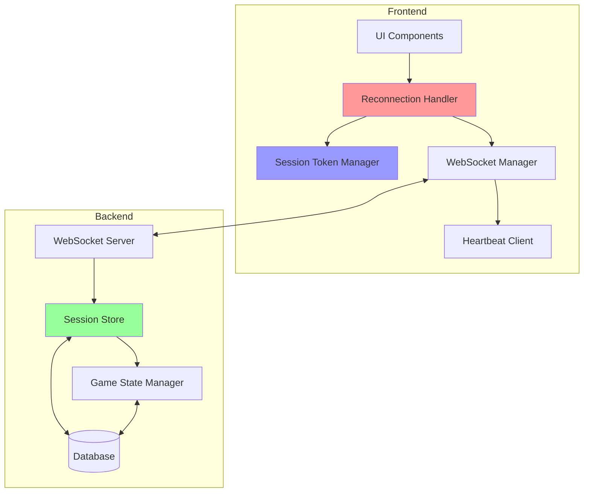

# Design Document: Reconnection & Session Management

## Overview

This design document outlines the architecture and implementation strategy for adding robust reconnection and session management capabilities to the Casino Card Game. The solution addresses the current limitation where players lose their game session upon disconnection, resulting in poor user experience.

The design introduces a multi-layered approach:
1. **Frontend Reconnection Layer** - Detects disconnections and orchestrates reconnection attempts
2. **Backend Session Persistence** - Maintains session state across disconnections
3. **Connection Health Monitoring** - Proactive detection of connection issues
4. **State Recovery System** - Ensures consistent game state after reconnection

### Design Goals

- Minimize user disruption during temporary network issues
- Maintain game integrity and prevent state corruption
- Provide clear feedback about connection status
- Handle edge cases (multi-tab, abandoned games, critical actions)
- Ensure security of session tokens
- Maintain backward compatibility with existing game flow

### Non-Goals

- Offline gameplay (game requires server connection)
- P2P connection fallback
- Mobile app-specific reconnection (web-only for now)

## Architecture

### High-Level Architecture




### Component Interaction Flow

1. **Normal Operation**: UI → WebSocket → Backend → Database
2. **Disconnection Detected**: Heartbeat fails → Reconnection Handler activated
3. **Reconnection**: Session Token retrieved → WebSocket reconnects → Session validated
4. **State Recovery**: Backend sends current state → UI updates → Game resumes


## Components and Interfaces

### 1. Frontend: Reconnection Handler

**Location**: `hooks/useReconnection.ts`

**Responsibilities**:
- Detect WebSocket disconnections
- Implement exponential backoff retry strategy
- Coordinate with Session Token Manager
- Update UI with connection status
- Handle reconnection success/failure

**Interface**:
```typescript
interface ReconnectionHandler {
  // State
  isReconnecting: boolean
  reconnectAttempts: number
  maxAttempts: number
  
  // Methods
  startReconnection(): void
  stopReconnection(): void
  resetAttempts(): void
  
  // Callbacks
  onReconnectSuccess: () => void
  onReconnectFailure: (error: Error) => void
  onMaxAttemptsReached: () => void
}
```

**Key Algorithms**:
- Exponential Backoff: `delay = baseDelay * (2 ^ attemptNumber)` with max 16s
- Jitter: Add random 0-1000ms to prevent thundering herd


### 2. Frontend: Session Token Manager

**Location**: `utils/sessionToken.ts`

**Responsibilities**:
- Generate and store session tokens in localStorage
- Retrieve tokens for reconnection
- Validate token expiration
- Clear tokens on logout

**Interface**:
```typescript
interface SessionToken {
  roomId: string
  playerId: number
  playerName: string
  signature: string
  expiresAt: number
  createdAt: number
}

interface SessionTokenManager {
  createToken(roomId: string, playerId: number, playerName: string): SessionToken
  getToken(roomId: string): SessionToken | null
  validateToken(token: SessionToken): boolean
  clearToken(roomId: string): void
  clearAllTokens(): void
}
```

**Storage Strategy**:
- Key format: `casino_session_${roomId}`
- Expiration: 24 hours from creation
- Signature: HMAC-SHA256 of `${roomId}:${playerId}:${createdAt}`


### 3. Frontend: Heartbeat Client

**Location**: `hooks/useHeartbeat.ts`

**Responsibilities**:
- Send periodic ping messages
- Monitor pong responses
- Detect connection health degradation
- Trigger reconnection on timeout

**Interface**:
```typescript
interface HeartbeatClient {
  // Configuration
  pingInterval: number // 10 seconds
  pongTimeout: number  // 15 seconds
  
  // State
  isHealthy: boolean
  lastPongTime: number
  consecutiveFailures: number
  
  // Methods
  start(): void
  stop(): void
  sendPing(): void
  handlePong(): void
  
  // Callbacks
  onHealthy: () => void
  onUnhealthy: () => void
  onTimeout: () => void
}
```

**Health Detection Logic**:
```
if (timeSinceLastPong > pongTimeout) {
  consecutiveFailures++
  if (consecutiveFailures >= 3) {
    triggerReconnection()
  }
} else if (consecutiveSuccesses >= 3) {
  markHealthy()
}
```


### 4. Frontend: Connection Status UI

**Location**: `components/ConnectionStatus.tsx`

**Responsibilities**:
- Display current connection state
- Show reconnection progress
- Provide manual retry option
- Display opponent connection status

**Interface**:
```typescript
interface ConnectionStatusProps {
  status: 'connected' | 'unhealthy' | 'reconnecting' | 'disconnected'
  reconnectAttempt?: number
  maxAttempts?: number
  onManualRetry?: () => void
  opponentConnected?: boolean
  opponentDisconnectedDuration?: number
}
```

**Visual States**:
- Connected: Green dot, "Connected"
- Unhealthy: Yellow dot, "Connection unstable"
- Reconnecting: Orange spinner, "Reconnecting... (attempt X/5)"
- Disconnected: Red dot, "Disconnected" + Retry button


### 5. Backend: Session Store

**Location**: `backend/session_manager.py`

**Responsibilities**:
- Persist active sessions in database
- Validate session tokens
- Track connection status per player
- Handle session timeouts
- Manage abandoned games

**Interface**:
```python
class SessionManager:
    def create_session(self, room_id: str, player_id: int, 
                      player_name: str) -> SessionToken:
        """Create new session and return token"""
        
    def validate_session(self, token: str) -> Optional[Session]:
        """Validate token and return session if valid"""
        
    def update_heartbeat(self, session_id: str) -> None:
        """Update last heartbeat timestamp"""
        
    def mark_disconnected(self, session_id: str) -> None:
        """Mark session as disconnected"""
        
    def mark_reconnected(self, session_id: str) -> None:
        """Mark session as reconnected"""
        
    def check_abandoned_games(self) -> List[str]:
        """Find games with disconnected players > 5 min"""
        
    def cleanup_expired_sessions(self) -> int:
        """Remove sessions older than 24 hours"""
```

**Database Schema Extension**:
```python
class GameSession(Base):
    __tablename__ = "game_sessions"
    
    id = Column(String(36), primary_key=True)
    room_id = Column(String(6), ForeignKey("rooms.id"))
    player_id = Column(Integer, ForeignKey("players.id"))
    session_token = Column(String(256), unique=True, index=True)
    connected_at = Column(DateTime(timezone=True))
    last_heartbeat = Column(DateTime(timezone=True))
    disconnected_at = Column(DateTime(timezone=True), nullable=True)
    is_active = Column(Boolean, default=True)
    ip_address = Column(String(45))
    user_agent = Column(String(256))
```


### 6. Backend: WebSocket Connection Manager

**Location**: `backend/websocket_manager.py`

**Responsibilities**:
- Handle WebSocket connections/disconnections
- Route messages to appropriate handlers
- Implement heartbeat protocol
- Broadcast connection status changes
- Handle reconnection requests

**Interface**:
```python
class WebSocketManager:
    def __init__(self):
        self.active_connections: Dict[str, WebSocket] = {}
        self.session_manager = SessionManager()
        
    async def connect(self, websocket: WebSocket, room_id: str, 
                     session_token: str) -> bool:
        """Establish WebSocket connection with session validation"""
        
    async def disconnect(self, room_id: str, player_id: int) -> None:
        """Handle disconnection and update session"""
        
    async def handle_heartbeat(self, room_id: str, player_id: int) -> None:
        """Process heartbeat ping and respond with pong"""
        
    async def broadcast_connection_status(self, room_id: str) -> None:
        """Notify all players of connection status changes"""
        
    async def send_game_state(self, room_id: str, player_id: int) -> None:
        """Send current game state to reconnected player"""
```

**Message Protocol**:
```json
// Ping
{
  "type": "ping",
  "timestamp": 1699876543210
}

// Pong
{
  "type": "pong",
  "timestamp": 1699876543210,
  "serverTime": 1699876543215
}

// Connection Status
{
  "type": "connection_status",
  "players": [
    {"id": 1, "connected": true},
    {"id": 2, "connected": false, "disconnectedSince": 1699876543210}
  ]
}
```


### 7. Backend: Game State Recovery Service

**Location**: `backend/state_recovery.py`

**Responsibilities**:
- Retrieve current game state for reconnecting player
- Calculate missed actions summary
- Validate state consistency
- Handle race conditions during reconnection

**Interface**:
```python
class StateRecoveryService:
    def get_recovery_state(self, room_id: str, 
                          player_id: int) -> RecoveryState:
        """Get complete state for player reconnection"""
        
    def get_missed_actions(self, room_id: str, player_id: int,
                          since: datetime) -> List[GameAction]:
        """Get actions that occurred during disconnection"""
        
    def validate_state_consistency(self, room_id: str) -> bool:
        """Verify game state integrity"""
```

**Recovery State Structure**:
```python
@dataclass
class RecoveryState:
    game_state: GameState
    missed_actions: List[GameAction]
    is_your_turn: bool
    time_disconnected: int  # seconds
    opponent_status: str  # "connected" | "disconnected"
```


## Data Models

### Session Token Structure

```typescript
interface SessionToken {
  // Identification
  roomId: string          // 6-character room code
  playerId: number        // Player database ID
  playerName: string      // Display name
  
  // Security
  signature: string       // HMAC-SHA256 signature
  nonce: string          // Random value for uniqueness
  
  // Timing
  createdAt: number      // Unix timestamp (ms)
  expiresAt: number      // Unix timestamp (ms)
  
  // Metadata
  version: number        // Token format version (1)
}
```

### Session State (Database)

```python
class GameSession(Base):
    # Identity
    id: str                    # UUID
    room_id: str              # Foreign key to rooms
    player_id: int            # Foreign key to players
    session_token: str        # Encrypted token
    
    # Connection tracking
    connected_at: datetime
    last_heartbeat: datetime
    disconnected_at: datetime | None
    reconnected_at: datetime | None
    
    # Status
    is_active: bool
    connection_count: int     # Number of reconnections
    
    # Security
    ip_address: str
    user_agent: str
    
    # Metadata
    created_at: datetime
    updated_at: datetime
```


### Game Action Log (for Recovery)

```python
class GameActionLog(Base):
    __tablename__ = "game_action_log"
    
    id = Column(Integer, primary_key=True)
    room_id = Column(String(6), ForeignKey("rooms.id"))
    player_id = Column(Integer, ForeignKey("players.id"))
    action_type = Column(String(50))  # "capture", "build", "trail"
    action_data = Column(JSON)
    timestamp = Column(DateTime(timezone=True))
    sequence_number = Column(Integer)  # For ordering
```

## Error Handling

### Reconnection Failure Scenarios

1. **Invalid Session Token**
   - Response: 401 Unauthorized
   - Action: Clear token, redirect to lobby
   - Message: "Session expired. Please rejoin the game."

2. **Game Already Ended**
   - Response: 410 Gone
   - Action: Show final results, clear session
   - Message: "Game has ended. Final score: X-Y"

3. **Room Not Found**
   - Response: 404 Not Found
   - Action: Clear token, redirect to lobby
   - Message: "Game room no longer exists."

4. **Max Reconnection Attempts**
   - Response: N/A (client-side)
   - Action: Show manual retry button
   - Message: "Unable to reconnect. Check your connection and try again."

5. **Concurrent Connection Detected**
   - Response: 409 Conflict
   - Action: Offer to take over session
   - Message: "Game is open in another tab. Take over this session?"


### Network Error Handling

```typescript
class ReconnectionError extends Error {
  constructor(
    public code: string,
    public message: string,
    public retryable: boolean
  ) {
    super(message)
  }
}

// Error codes
const ERRORS = {
  NETWORK_TIMEOUT: { code: 'NET_TIMEOUT', retryable: true },
  INVALID_TOKEN: { code: 'AUTH_INVALID', retryable: false },
  SESSION_EXPIRED: { code: 'AUTH_EXPIRED', retryable: false },
  GAME_ENDED: { code: 'GAME_ENDED', retryable: false },
  MAX_ATTEMPTS: { code: 'MAX_ATTEMPTS', retryable: false },
  SERVER_ERROR: { code: 'SERVER_ERROR', retryable: true },
}
```

## Testing Strategy

### Unit Tests

**Frontend**:
- `useReconnection.test.ts` - Reconnection logic and exponential backoff
- `sessionToken.test.ts` - Token generation, validation, storage
- `useHeartbeat.test.ts` - Ping/pong protocol and health detection
- `ConnectionStatus.test.tsx` - UI state rendering

**Backend**:
- `test_session_manager.py` - Session CRUD operations
- `test_websocket_manager.py` - Connection handling
- `test_state_recovery.py` - State retrieval and validation
- `test_token_validation.py` - Security and signature verification


### Integration Tests

1. **Basic Reconnection Flow**
   - Player connects → disconnects → reconnects
   - Verify game state preserved
   - Verify turn order maintained

2. **Abandoned Game Handling**
   - Player disconnects for 5+ minutes
   - Verify opponent notified
   - Verify game can be claimed or waited

3. **Multi-Tab Prevention**
   - Open game in two tabs
   - Verify warning displayed
   - Verify session transfer works

4. **Critical Action During Disconnect**
   - Player plays card → immediate disconnect
   - Verify action processed
   - Verify no duplicate actions on reconnect

5. **Heartbeat Failure Detection**
   - Simulate network degradation
   - Verify unhealthy status shown
   - Verify automatic reconnection triggered

### E2E Tests

```typescript
// tests/e2e/reconnection.spec.ts
test('player reconnects after brief disconnect', async ({ page, context }) => {
  // Setup: Join game
  await page.goto('/cassino')
  await joinGame(page, 'Player1')
  
  // Simulate disconnect
  await context.setOffline(true)
  await page.waitForSelector('[data-testid="reconnecting-indicator"]')
  
  // Reconnect
  await context.setOffline(false)
  await page.waitForSelector('[data-testid="connected-indicator"]')
  
  // Verify state preserved
  expect(await page.textContent('[data-testid="room-code"]')).toBeTruthy()
})
```


### Performance Tests

1. **Reconnection Speed**
   - Target: < 2 seconds from disconnect to reconnected
   - Measure: Time from connection close to state recovery complete

2. **Heartbeat Overhead**
   - Target: < 1% CPU usage
   - Measure: CPU and network usage with heartbeat active

3. **Session Lookup Performance**
   - Target: < 50ms for token validation
   - Measure: Database query time for session retrieval

4. **Concurrent Reconnections**
   - Target: Handle 100 simultaneous reconnections
   - Measure: Server response time under load

## Security Considerations

### Token Security

1. **Signature Validation**
   - Use HMAC-SHA256 with server-side secret
   - Include timestamp to prevent replay attacks
   - Validate signature before any session operation

2. **Token Storage**
   - Store in localStorage (not sessionStorage for persistence)
   - Clear on explicit logout
   - Auto-expire after 24 hours

3. **Transport Security**
   - Always use WSS (WebSocket Secure) in production
   - Validate SSL certificates
   - Implement rate limiting on reconnection attempts


### Attack Prevention

1. **Session Hijacking**
   - Mitigation: Cryptographic signatures, IP tracking
   - Detection: Log IP changes, unusual reconnection patterns
   - Response: Require re-authentication on suspicious activity

2. **Denial of Service**
   - Mitigation: Rate limit reconnection attempts (5 per minute)
   - Detection: Monitor reconnection frequency per IP
   - Response: Temporary IP ban after threshold

3. **Token Replay**
   - Mitigation: Include nonce and timestamp in token
   - Detection: Check for duplicate nonce values
   - Response: Reject duplicate tokens

## Deployment Strategy

### Phase 1: Backend Infrastructure (Week 1)
- Add GameSession table migration
- Implement SessionManager
- Add session token generation/validation
- Deploy to staging

### Phase 2: WebSocket Enhancements (Week 1-2)
- Implement heartbeat protocol
- Add reconnection endpoint
- Update WebSocketManager
- Test with staging frontend

### Phase 3: Frontend Implementation (Week 2)
- Create useReconnection hook
- Implement SessionTokenManager
- Add ConnectionStatus component
- Integrate with existing hooks

### Phase 4: Testing & Refinement (Week 3)
- Run comprehensive test suite
- Performance testing
- Security audit
- Bug fixes

### Phase 5: Production Rollout (Week 3-4)
- Deploy to production
- Monitor metrics
- Gradual rollout with feature flag
- Full release after validation


## Monitoring & Metrics

### Key Metrics to Track

1. **Reconnection Success Rate**
   - Formula: `successful_reconnections / total_reconnection_attempts`
   - Target: > 95%
   - Alert: < 90%

2. **Average Reconnection Time**
   - Measure: Time from disconnect to state recovery
   - Target: < 2 seconds
   - Alert: > 5 seconds

3. **Session Abandonment Rate**
   - Formula: `abandoned_sessions / total_sessions`
   - Target: < 5%
   - Alert: > 10%

4. **Heartbeat Failure Rate**
   - Formula: `failed_heartbeats / total_heartbeats`
   - Target: < 1%
   - Alert: > 5%

### Logging Strategy

```python
# Backend logging
logger.info("session_created", extra={
    "room_id": room_id,
    "player_id": player_id,
    "session_id": session_id
})

logger.warning("reconnection_failed", extra={
    "room_id": room_id,
    "player_id": player_id,
    "attempt": attempt_number,
    "error": error_message
})

logger.error("session_hijack_detected", extra={
    "session_id": session_id,
    "original_ip": original_ip,
    "new_ip": new_ip
})
```

## Migration Plan

### Database Migration

```python
# alembic/versions/xxx_add_session_management.py
def upgrade():
    # Add session_token column to game_sessions
    op.add_column('game_sessions', 
        sa.Column('session_token', sa.String(256), nullable=True))
    op.create_index('ix_game_sessions_token', 'game_sessions', 
        ['session_token'], unique=True)
    
    # Add disconnected_at column
    op.add_column('game_sessions',
        sa.Column('disconnected_at', sa.DateTime(timezone=True), 
        nullable=True))
    
    # Add connection_count column
    op.add_column('game_sessions',
        sa.Column('connection_count', sa.Integer, default=0))

def downgrade():
    op.drop_index('ix_game_sessions_token')
    op.drop_column('game_sessions', 'session_token')
    op.drop_column('game_sessions', 'disconnected_at')
    op.drop_column('game_sessions', 'connection_count')
```

### Backward Compatibility

- Existing sessions without tokens continue to work
- New sessions automatically get tokens
- Gradual migration over 30 days
- Old session cleanup after migration period

## Future Enhancements

1. **Predictive Reconnection**
   - Detect network quality degradation
   - Pre-emptively prepare for reconnection
   - Cache game state locally

2. **Offline Queue**
   - Queue actions during disconnect
   - Replay on reconnection
   - Conflict resolution

3. **Mobile Optimization**
   - Detect mobile network transitions
   - Faster reconnection on mobile
   - Background reconnection support

4. **Analytics Dashboard**
   - Real-time connection health
   - Reconnection patterns
   - Geographic connection quality

---

**Design Version:** 1.0  
**Last Updated:** November 12, 2025  
**Status:** Ready for Review
