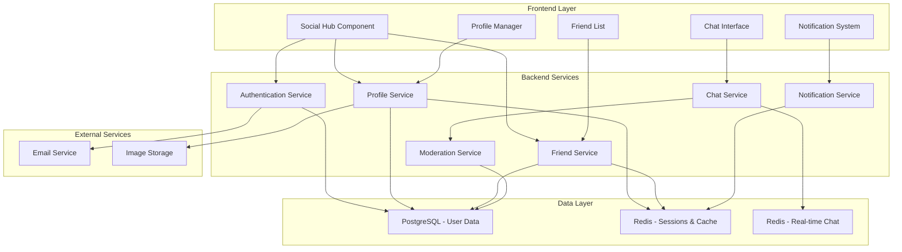

# Design Document: Social Features

## Overview

The Social Features system extends the Casino Card Game with comprehensive social functionality including user authentication, player profiles, friend management, and real-time chat. The design integrates seamlessly with the existing Redis-based session management and WebSocket infrastructure while adding new persistent data models and real-time communication channels.

The system follows a layered architecture with clear separation between authentication, social data management, real-time communication, and content moderation. All social features are designed to scale horizontally and integrate with the existing game infrastructure.

## Architecture

### System Components



### Integration with Existing System

The social features integrate with the existing Casino Card Game infrastructure:

- **Session Management**: Extends existing Redis-based sessions with social authentication
- **WebSocket Manager**: Adds social channels (chat, notifications) to existing game channels
- **Database**: Adds new tables to existing PostgreSQL schema
- **Cache Manager**: Extends Redis caching for social data (friends, profiles, chat history)

## Components and Interfaces

### 1. Authentication Service

Manages user registration, login, and persistent identity.

```python
class AuthenticationService:
    def __init__(self, db: Session, email_service: EmailService, cache_manager: CacheManager):
        self.db = db
        self.email_service = email_service
        self.cache_manager = cache_manager
    
    async def register_user(self, username: str, email: str, password: str) -> UserRegistrationResult:
        """
        Register a new user account with email verification
        """
        # Validate input
        if await self.username_exists(username):
            raise ValidationError("Username already exists")
        
        if await self.email_exists(email):
            raise ValidationError("Email already registered")
        
        # Hash password
        password_hash = bcrypt.hashpw(password.encode(), bcrypt.gensalt())
        
        # Create user record
        user = User(
            username=username,
            email=email,
            password_hash=password_hash,
            is_verified=False,
            created_at=datetime.utcnow()
        )
        
        self.db.add(user)
        self.db.commit()
        
        # Send verification email
        verification_token = self.generate_verification_token(user.id)
        await self.email_service.send_verification_email(email, verification_token)
        
        return UserRegistrationResult(user_id=user.id, verification_sent=True)
    
    async def authenticate_user(self, username: str, password: str) -> AuthenticationResult:
        """
        Authenticate user and create session
        """
        user = self.db.query(User).filter(User.username == username).first()
        
        if not user or not bcrypt.checkpw(password.encode(), user.password_hash):
            raise AuthenticationError("Invalid credentials")
        
        if not user.is_verified:
            raise AuthenticationError("Account not verified")
        
        # Create session token
        session_token = self.generate_session_token()
        
        # Store in Redis with extended TTL for social features
        await self.cache_manager.store_user_session(
            token=session_token,
            user_id=user.id,
            ttl=86400  # 24 hours for social sessions
        )
        
        return AuthenticationResult(
            user_id=user.id,
            session_token=session_token,
            profile=await self.get_user_profile(user.id)
        )
```

### 2. Profile Service

Manages user profiles, statistics, and privacy settings.

```python
class ProfileService:
    def __init__(self, db: Session, cache_manager: CacheManager, image_storage: ImageStorage):
        self.db = db
        self.cache_manager = cache_manager
        self.image_storage = image_storage
    
    async def get_profile(self, user_id: int, viewer_id: int = None) -> UserProfile:
        """
        Get user profile with privacy filtering
        """
        # Check cache first
        cache_key = f"profile:{user_id}"
        cached_profile = await self.cache_manager.get_json(cache_key)
        
        if cached_profile:
            profile = UserProfile.from_dict(cached_profile)
        else:
            # Load from database
            user = self.db.query(User).filter(User.id == user_id).first()
            if not user:
                raise NotFoundError("User not found")
            
            profile = UserProfile(
                user_id=user.id,
                username=user.username,
                display_name=user.display_name or user.username,
                bio=user.bio,
                avatar_url=user.avatar_url,
                privacy_settings=user.privacy_settings,
                statistics=await self.get_user_statistics(user_id),
                created_at=user.created_at
            )
            
            # Cache for 30 minutes
            await self.cache_manager.set_json(cache_key, profile.to_dict(), ttl=1800)
        
        # Apply privacy filtering
        if viewer_id != user_id:
            profile = await self.apply_privacy_filter(profile, viewer_id)
        
        return profile
    
    async def update_profile(self, user_id: int, updates: ProfileUpdateRequest) -> UserProfile:
        """
        Update user profile information
        """
        user = self.db.query(User).filter(User.id == user_id).first()
        if not user:
            raise NotFoundError("User not found")
        
        # Update fields
        if updates.display_name:
            user.display_name = updates.display_name
        if updates.bio:
            user.bio = updates.bio
        if updates.privacy_settings:
            user.privacy_settings = updates.privacy_settings
        
        user.updated_at = datetime.utcnow()
        self.db.commit()
        
        # Invalidate cache
        await self.cache_manager.delete(f"profile:{user_id}")
        
        # Return updated profile
        return await self.get_profile(user_id, user_id)
    
    async def upload_avatar(self, user_id: int, image_data: bytes, content_type: str) -> str:
        """
        Upload and process user avatar image
        """
        # Validate image
        if not self.is_valid_image(image_data, content_type):
            raise ValidationError("Invalid image format")
        
        # Resize and optimize
        processed_image = await self.process_avatar_image(image_data)
        
        # Upload to storage
        avatar_url = await self.image_storage.upload(
            f"avatars/{user_id}.jpg",
            processed_image,
            content_type="image/jpeg"
        )
        
        # Update user record
        user = self.db.query(User).filter(User.id == user_id).first()
        user.avatar_url = avatar_url
        user.updated_at = datetime.utcnow()
        self.db.commit()
        
        # Invalidate cache
        await self.cache_manager.delete(f"profile:{user_id}")
        
        return avatar_url
```

### 3. Friend Service

Manages friend relationships, requests, and social connections.

```python
class FriendService:
    def __init__(self, db: Session, cache_manager: CacheManager, notification_service: NotificationService):
        self.db = db
        self.cache_manager = cache_manager
        self.notification_service = notification_service
    
    async def send_friend_request(self, sender_id: int, recipient_username: str) -> FriendRequestResult:
        """
        Send a friend request to another user
        """
        # Find recipient
        recipient = self.db.query(User).filter(User.username == recipient_username).first()
        if not recipient:
            raise NotFoundError("User not found")
        
        if sender_id == recipient.id:
            raise ValidationError("Cannot send friend request to yourself")
        
        # Check if already friends or request exists
        existing = self.db.query(Friendship).filter(
            or_(
                and_(Friendship.user1_id == sender_id, Friendship.user2_id == recipient.id),
                and_(Friendship.user1_id == recipient.id, Friendship.user2_id == sender_id)
            )
        ).first()
        
        if existing:
            if existing.status == FriendshipStatus.ACCEPTED:
                raise ValidationError("Already friends")
            elif existing.status == FriendshipStatus.PENDING:
                raise ValidationError("Friend request already sent")
        
        # Create friend request
        friendship = Friendship(
            user1_id=sender_id,
            user2_id=recipient.id,
            status=FriendshipStatus.PENDING,
            created_at=datetime.utcnow()
        )
        
        self.db.add(friendship)
        self.db.commit()
        
        # Send notification
        await self.notification_service.send_friend_request_notification(
            recipient_id=recipient.id,
            sender_username=await self.get_username(sender_id)
        )
        
        # Invalidate caches
        await self.invalidate_friend_caches([sender_id, recipient.id])
        
        return FriendRequestResult(request_id=friendship.id, status="sent")
    
    async def respond_to_friend_request(self, user_id: int, request_id: int, accept: bool) -> FriendshipResult:
        """
        Accept or decline a friend request
        """
        friendship = self.db.query(Friendship).filter(
            Friendship.id == request_id,
            Friendship.user2_id == user_id,
            Friendship.status == FriendshipStatus.PENDING
        ).first()
        
        if not friendship:
            raise NotFoundError("Friend request not found")
        
        if accept:
            friendship.status = FriendshipStatus.ACCEPTED
            friendship.accepted_at = datetime.utcnow()
            
            # Send acceptance notification
            await self.notification_service.send_friend_accepted_notification(
                user_id=friendship.user1_id,
                accepter_username=await self.get_username(user_id)
            )
        else:
            friendship.status = FriendshipStatus.DECLINED
        
        self.db.commit()
        
        # Invalidate caches
        await self.invalidate_friend_caches([friendship.user1_id, friendship.user2_id])
        
        return FriendshipResult(
            friendship_id=friendship.id,
            status=friendship.status.value,
            friend_profile=await self.get_friend_profile(friendship.user1_id, user_id) if accept else None
        )
    
    async def get_friends_list(self, user_id: int) -> List[FriendInfo]:
        """
        Get user's friends list with online status
        """
        cache_key = f"friends:{user_id}"
        cached_friends = await self.cache_manager.get_json(cache_key)
        
        if cached_friends:
            friends = [FriendInfo.from_dict(f) for f in cached_friends]
        else:
            # Query friendships
            friendships = self.db.query(Friendship).filter(
                or_(
                    and_(Friendship.user1_id == user_id, Friendship.status == FriendshipStatus.ACCEPTED),
                    and_(Friendship.user2_id == user_id, Friendship.status == FriendshipStatus.ACCEPTED)
                )
            ).all()
            
            friends = []
            for friendship in friendships:
                friend_id = friendship.user2_id if friendship.user1_id == user_id else friendship.user1_id
                friend_profile = await self.get_friend_profile(friend_id, user_id)
                
                friends.append(FriendInfo(
                    user_id=friend_id,
                    username=friend_profile.username,
                    display_name=friend_profile.display_name,
                    avatar_url=friend_profile.avatar_url,
                    friendship_date=friendship.accepted_at
                ))
            
            # Cache for 10 minutes
            await self.cache_manager.set_json(
                cache_key,
                [f.to_dict() for f in friends],
                ttl=600
            )
        
        # Add real-time online status
        for friend in friends:
            friend.is_online = await self.is_user_online(friend.user_id)
            friend.last_seen = await self.get_last_seen(friend.user_id)
        
        return friends
```

### 4. Chat Service

Manages real-time messaging for in-game and global chat.

```python
class ChatService:
    def __init__(self, redis_client: Redis, moderation_service: ModerationService, websocket_manager: WebSocketManager):
        self.redis = redis_client
        self.moderation = moderation_service
        self.websocket_manager = websocket_manager
    
    async def send_game_message(self, room_id: str, sender_id: int, message: str) -> ChatMessage:
        """
        Send a message in game chat
        """
        # Validate and moderate message
        moderated_message = await self.moderation.moderate_message(message, sender_id)
        
        if moderated_message.is_blocked:
            raise ModerationError("Message blocked by content filter")
        
        # Create message object
        chat_message = ChatMessage(
            id=str(uuid.uuid4()),
            room_id=room_id,
            sender_id=sender_id,
            sender_username=await self.get_username(sender_id),
            message=moderated_message.content,
            timestamp=datetime.utcnow(),
            message_type=MessageType.GAME_CHAT
        )
        
        # Store in Redis with TTL (game duration)
        await self.redis.lpush(
            f"chat:game:{room_id}",
            chat_message.to_json()
        )
        await self.redis.expire(f"chat:game:{room_id}", 7200)  # 2 hours
        
        # Broadcast to room participants
        await self.websocket_manager.broadcast_to_room(
            room_id=room_id,
            message_type="chat_message",
            data=chat_message.to_dict()
        )
        
        return chat_message
    
    async def send_private_message(self, sender_id: int, recipient_id: int, message: str) -> ChatMessage:
        """
        Send a private message between friends
        """
        # Verify friendship
        if not await self.are_friends(sender_id, recipient_id):
            raise PermissionError("Can only send private messages to friends")
        
        # Check if recipient has blocked sender
        if await self.is_blocked(sender_id, recipient_id):
            raise PermissionError("Cannot send message to this user")
        
        # Moderate message
        moderated_message = await self.moderation.moderate_message(message, sender_id)
        
        if moderated_message.is_blocked:
            raise ModerationError("Message blocked by content filter")
        
        # Create message
        chat_message = ChatMessage(
            id=str(uuid.uuid4()),
            sender_id=sender_id,
            recipient_id=recipient_id,
            sender_username=await self.get_username(sender_id),
            message=moderated_message.content,
            timestamp=datetime.utcnow(),
            message_type=MessageType.PRIVATE_MESSAGE
        )
        
        # Store conversation history
        conversation_key = self.get_conversation_key(sender_id, recipient_id)
        await self.redis.lpush(conversation_key, chat_message.to_json())
        await self.redis.expire(conversation_key, 2592000)  # 30 days
        
        # Send to recipient if online
        if await self.is_user_online(recipient_id):
            await self.websocket_manager.send_to_user(
                user_id=recipient_id,
                message_type="private_message",
                data=chat_message.to_dict()
            )
        
        return chat_message
    
    async def get_chat_history(self, room_id: str = None, user1_id: int = None, user2_id: int = None, limit: int = 50) -> List[ChatMessage]:
        """
        Get chat history for game room or private conversation
        """
        if room_id:
            # Game chat history
            messages = await self.redis.lrange(f"chat:game:{room_id}", 0, limit - 1)
        elif user1_id and user2_id:
            # Private conversation history
            conversation_key = self.get_conversation_key(user1_id, user2_id)
            messages = await self.redis.lrange(conversation_key, 0, limit - 1)
        else:
            raise ValueError("Must specify either room_id or both user IDs")
        
        # Parse messages
        chat_messages = []
        for msg_json in reversed(messages):  # Reverse to get chronological order
            chat_messages.append(ChatMessage.from_json(msg_json))
        
        return chat_messages
```

## Data Models

### Database Schema

```sql
-- Users table (extends existing or new)
CREATE TABLE users (
    id SERIAL PRIMARY KEY,
    username VARCHAR(50) UNIQUE NOT NULL,
    email VARCHAR(255) UNIQUE NOT NULL,
    password_hash VARCHAR(255) NOT NULL,
    display_name VARCHAR(100),
    bio TEXT,
    avatar_url VARCHAR(500),
    is_verified BOOLEAN DEFAULT FALSE,
    privacy_settings JSONB DEFAULT '{}',
    created_at TIMESTAMP DEFAULT CURRENT_TIMESTAMP,
    updated_at TIMESTAMP DEFAULT CURRENT_TIMESTAMP
);

-- Friendships table
CREATE TABLE friendships (
    id SERIAL PRIMARY KEY,
    user1_id INTEGER REFERENCES users(id) ON DELETE CASCADE,
    user2_id INTEGER REFERENCES users(id) ON DELETE CASCADE,
    status VARCHAR(20) DEFAULT 'pending', -- pending, accepted, declined, blocked
    created_at TIMESTAMP DEFAULT CURRENT_TIMESTAMP,
    accepted_at TIMESTAMP,
    UNIQUE(user1_id, user2_id)
);

-- User statistics table
CREATE TABLE user_statistics (
    user_id INTEGER PRIMARY KEY REFERENCES users(id) ON DELETE CASCADE,
    games_played INTEGER DEFAULT 0,
    games_won INTEGER DEFAULT 0,
    total_score INTEGER DEFAULT 0,
    best_game_score INTEGER DEFAULT 0,
    current_streak INTEGER DEFAULT 0,
    longest_streak INTEGER DEFAULT 0,
    last_game_at TIMESTAMP,
    updated_at TIMESTAMP DEFAULT CURRENT_TIMESTAMP
);

-- Moderation reports table
CREATE TABLE moderation_reports (
    id SERIAL PRIMARY KEY,
    reporter_id INTEGER REFERENCES users(id) ON DELETE SET NULL,
    reported_user_id INTEGER REFERENCES users(id) ON DELETE CASCADE,
    report_type VARCHAR(50) NOT NULL, -- harassment, spam, inappropriate_content
    description TEXT,
    status VARCHAR(20) DEFAULT 'pending', -- pending, reviewed, resolved
    created_at TIMESTAMP DEFAULT CURRENT_TIMESTAMP,
    resolved_at TIMESTAMP,
    resolved_by INTEGER REFERENCES users(id) ON DELETE SET NULL
);

-- User blocks table
CREATE TABLE user_blocks (
    id SERIAL PRIMARY KEY,
    blocker_id INTEGER REFERENCES users(id) ON DELETE CASCADE,
    blocked_id INTEGER REFERENCES users(id) ON DELETE CASCADE,
    created_at TIMESTAMP DEFAULT CURRENT_TIMESTAMP,
    UNIQUE(blocker_id, blocked_id)
);

-- Indexes for performance
CREATE INDEX idx_friendships_user1 ON friendships(user1_id);
CREATE INDEX idx_friendships_user2 ON friendships(user2_id);
CREATE INDEX idx_friendships_status ON friendships(status);
CREATE INDEX idx_users_username ON users(username);
CREATE INDEX idx_users_email ON users(email);
CREATE INDEX idx_moderation_reports_status ON moderation_reports(status);
CREATE INDEX idx_user_blocks_blocker ON user_blocks(blocker_id);
```

### TypeScript Interfaces

```typescript
// Frontend data models
interface UserProfile {
  userId: number;
  username: string;
  displayName: string;
  bio?: string;
  avatarUrl?: string;
  statistics: UserStatistics;
  privacySettings: PrivacySettings;
  isOnline?: boolean;
  lastSeen?: Date;
}

interface UserStatistics {
  gamesPlayed: number;
  gamesWon: number;
  winRate: number;
  totalScore: number;
  bestGameScore: number;
  currentStreak: number;
  longestStreak: number;
  lastGameAt?: Date;
}

interface FriendInfo {
  userId: number;
  username: string;
  displayName: string;
  avatarUrl?: string;
  isOnline: boolean;
  lastSeen?: Date;
  friendshipDate: Date;
  unreadMessages: number;
}

interface ChatMessage {
  id: string;
  senderId: number;
  senderUsername: string;
  recipientId?: number;
  roomId?: string;
  message: string;
  timestamp: Date;
  messageType: 'game_chat' | 'private_message' | 'global_chat';
  isModerated?: boolean;
}

interface PrivacySettings {
  profileVisibility: 'public' | 'friends' | 'private';
  allowFriendRequests: boolean;
  allowPrivateMessages: 'everyone' | 'friends' | 'none';
  showOnlineStatus: boolean;
  showGameActivity: boolean;
}
```

## Correctness Properties

*A property is a characteristic or behavior that should hold true across all valid executions of a system—essentially, a formal statement about what the system should do. Properties serve as the bridge between human-readable specifications and machine-verifiable correctness guarantees.*

Based on the prework analysis, I've identified several key properties that can be tested across all inputs, along with some specific examples for UI components. After reviewing for redundancy, here are the consolidated correctness properties:

### Property 1: User Registration Validation
*For any* registration attempt with valid data (unique username, valid email, secure password), the system should create a new user account and send a verification email
**Validates: Requirements 1.2**

### Property 2: Authentication Round Trip
*For any* valid user account, authentication with correct credentials should succeed and establish a session, while authentication with incorrect credentials should fail
**Validates: Requirements 1.5, 1.6**

### Property 3: Duplicate Registration Prevention
*For any* registration attempt using existing username or email, the system should reject the registration and return an appropriate error
**Validates: Requirements 1.4**

### Property 4: Profile Update Consistency
*For any* profile update operation, changes should be immediately reflected in all system references (cache, database, API responses)
**Validates: Requirements 2.3**

### Property 5: Privacy Enforcement
*For any* user profile with privacy settings, information visibility should be correctly filtered based on the viewer's relationship to the profile owner
**Validates: Requirements 2.4, 2.6, 7.3**

### Property 6: Avatar Upload Validation
*For any* image upload, the system should validate file type and size constraints, accepting valid images and rejecting invalid ones
**Validates: Requirements 2.2**

### Property 7: Statistics Accuracy
*For any* completed game, user statistics should be updated correctly to reflect the new game outcome (games played, wins, losses, win rate)
**Validates: Requirements 2.5**

### Property 8: Friend Request Lifecycle
*For any* friend request between valid users, the complete lifecycle (send → notify → accept/decline → establish/cleanup relationship) should work correctly
**Validates: Requirements 3.2, 3.4, 3.5**

### Property 9: Friendship Bidirectionality
*For any* accepted friendship, the relationship should be bidirectional (both users see each other as friends) and symmetric
**Validates: Requirements 3.4**

### Property 10: User Search Functionality
*For any* username search query, the system should return matching results with appropriate action options (view profile, send friend request)
**Validates: Requirements 3.1**

### Property 11: Friend Removal Cleanup
*For any* friendship removal, the system should completely delete the relationship and notify both parties
**Validates: Requirements 3.6**

### Property 12: Chat Message Broadcasting
*For any* message sent in a game room, the message should be immediately delivered to all participants in that room
**Validates: Requirements 4.2**

### Property 13: Message Display Formatting
*For any* received chat message, it should be displayed with sender name, timestamp, and proper formatting
**Validates: Requirements 4.3**

### Property 14: Content Moderation Filtering
*For any* message containing inappropriate content, the system should filter or block the message according to moderation rules
**Validates: Requirements 4.4, 6.1**

### Property 15: Chat History Persistence
*For any* chat session, message history should be maintained and retrievable throughout the session duration
**Validates: Requirements 4.5, 4.6, 5.5**

### Property 16: Chat Muting Functionality
*For any* user who mutes chat, incoming messages should be hidden while preserving the ability to unmute and see messages again
**Validates: Requirements 4.7**

### Property 17: Global Chat Rate Limiting
*For any* user sending messages in global chat, the system should enforce rate limits while broadcasting messages to all online users
**Validates: Requirements 5.2**

### Property 18: Private Message Delivery
*For any* private message between friends, the message should be delivered with notifications and stored in conversation history
**Validates: Requirements 5.4, 5.5**

### Property 19: User Blocking Enforcement
*For any* blocked user relationship, all communication from the blocked user should be prevented across all channels
**Validates: Requirements 5.6**

### Property 20: Activity Tracking Accuracy
*For any* friend activity (coming online, starting games, achievements), the activity should be tracked and displayed to friends
**Validates: Requirements 3.7, 5.7**

### Property 21: Report Logging and Processing
*For any* user report for inappropriate behavior, the report should be logged and the reported account should be flagged for review
**Validates: Requirements 6.2**

### Property 22: Automated Moderation Escalation
*For any* user accumulating multiple reports, temporary chat restrictions should be automatically applied
**Validates: Requirements 6.3**

### Property 23: Moderation Audit Trail
*For any* moderation action (warnings, suspensions, bans), the action should be logged in audit trails for accountability
**Validates: Requirements 6.5, 6.6**

### Property 24: Do Not Disturb Enforcement
*For any* user with "Do Not Disturb" status, friend requests and private messages should be blocked except from existing friends
**Validates: Requirements 7.2**

### Property 25: Statistics Privacy Control
*For any* user with private statistics settings, game statistics should be hidden from non-authorized viewers
**Validates: Requirements 7.4**

### Property 26: Account Deletion Data Handling
*For any* account deletion request, personal data should be removed while preserving anonymized statistics
**Validates: Requirements 7.5**

### Property 27: Data Export Functionality
*For any* user requesting data export, the system should provide complete user data in a portable format
**Validates: Requirements 7.6**

### Property 28: Real-time Notification Delivery
*For any* social event (friend requests, messages, friend online status), appropriate notifications should be sent based on user preferences
**Validates: Requirements 8.1, 8.2, 8.3, 8.5**

### Property 29: Online Status Accuracy
*For any* friend relationship, online/offline status should be accurately reflected in real-time across all interfaces
**Validates: Requirements 8.4**

### Property 30: Notification Customization
*For any* notification preference setting, the system should respect user choices for different types of social activities
**Validates: Requirements 8.6**

### Property 31: Mention Highlighting
*For any* user mentioned in global chat, the message should be highlighted and a notification should be sent to the mentioned user
**Validates: Requirements 8.7**

## Error Handling

### Authentication Errors
- **Invalid Credentials**: Return 401 with clear error message
- **Unverified Account**: Return 403 with verification reminder
- **Account Locked**: Return 423 with unlock instructions
- **Session Expired**: Return 401 and redirect to login

### Social Interaction Errors
- **Friend Request to Self**: Return 400 with appropriate message
- **Duplicate Friend Request**: Return 409 with existing status
- **Message to Blocked User**: Return 403 without revealing block status
- **Private Message to Non-Friend**: Return 403 with friendship requirement

### Content Moderation Errors
- **Inappropriate Content**: Filter content and log incident
- **Rate Limit Exceeded**: Return 429 with retry-after header
- **Spam Detection**: Temporarily restrict user and notify moderators

### Privacy and Permission Errors
- **Profile Access Denied**: Return 403 or filtered data based on privacy settings
- **Unauthorized Action**: Return 403 with permission requirements
- **Resource Not Found**: Return 404 for non-existent users/content

### Data Validation Errors
- **Invalid Image Upload**: Return 400 with file requirements
- **Username/Email Taken**: Return 409 with availability check
- **Invalid Input Format**: Return 400 with validation details

## Testing Strategy

### Dual Testing Approach
The social features system requires both unit tests and property-based tests for comprehensive coverage:

**Unit Tests** focus on:
- Specific UI component rendering (registration form, profile page, chat interface)
- Integration points between services
- Edge cases and error conditions
- Authentication flows and session management

**Property-Based Tests** focus on:
- Universal properties across all user inputs and social interactions
- Data consistency across cache and database layers
- Privacy enforcement across all relationship combinations
- Message delivery and notification systems

### Property-Based Testing Configuration
- **Framework**: Use Hypothesis (Python backend) and fast-check (TypeScript frontend)
- **Test Iterations**: Minimum 100 iterations per property test
- **Test Tagging**: Each property test references its design document property
- **Tag Format**: **Feature: social-features, Property {number}: {property_text}**

### Testing Categories

**Authentication and Registration Testing**:
- Property tests for registration validation, authentication flows, and session management
- Unit tests for specific error conditions and edge cases
- Integration tests for email verification and password reset flows

**Social Relationship Testing**:
- Property tests for friend request lifecycle, search functionality, and relationship management
- Unit tests for UI components (friend list, search results, request notifications)
- Integration tests for real-time friend status updates

**Chat and Messaging Testing**:
- Property tests for message delivery, content moderation, and chat history
- Unit tests for chat UI components and message formatting
- Integration tests for WebSocket message broadcasting and private messaging

**Privacy and Security Testing**:
- Property tests for privacy enforcement, blocking functionality, and data access control
- Unit tests for privacy settings UI and permission checks
- Security tests for authentication, authorization, and data protection

**Performance and Scalability Testing**:
- Load tests for concurrent users, message broadcasting, and friend list updates
- Cache performance tests for profile data, friend lists, and chat history
- Database performance tests for complex social queries and statistics updates

### Test Data Management
- Use factories for generating realistic test users, friendships, and messages
- Implement cleanup procedures for test data in shared environments
- Use separate test databases and Redis instances for isolation
- Mock external services (email, image storage) in unit tests

Now I need to complete the design document with the correctness properties section. Let me use the prework tool to analyze the acceptance criteria first.

<function_calls>
<invoke name="prework">
<parameter name="featureName">social-features