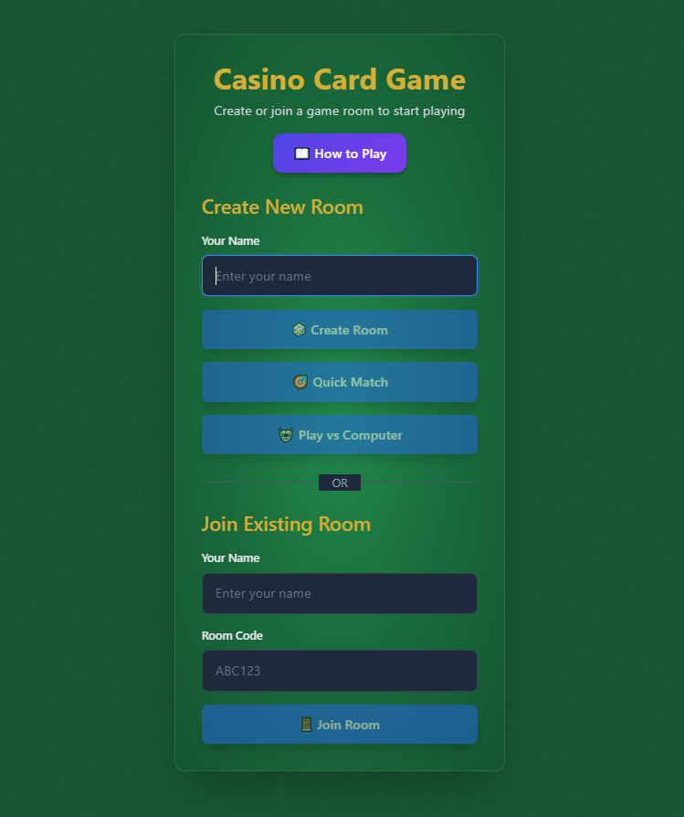

# 🎮 Casino Card Game - Multiplayer Online

A real-time multiplayer implementation of the classic Casino card game. Play head-to-head matches with friends, capture cards, build combinations, and compete for the highest score!

**Live Demo:** https://khasinogaming.com/cassino/

[](https://github.com/Malungisa-Mndzebele/cassino-card-game)
[](https://cassino-game-backend.onrender.com)
[](https://khasinogaming.com/cassino/)

---

## 📸 Game Preview

<p align="center">
  
</p>

<p align="center">
  <em>Create a room, join with friends, or play against the computer!</em>
</p>

---

## 🚀 Quick Start

### Local Development

1. **Install Dependencies**
```bash
npm run install:all
```

2. **Start Backend**
```bash
npm run start:backend
# Backend runs on http://localhost:8000
```

3. **Start Frontend** (in a new terminal)
```bash
npm run dev
# Frontend runs on http://localhost:5173
```

4. **Play the Game**
- Open http://localhost:5173
- Create a room or join with a friend
- Enjoy!

---

## 🎯 Game Rules

### Objective
Score the most points by capturing cards from the table. First player to 11 points wins!

### Scoring System
- **Aces**: 1 point each (4 total)
- **2 of Spades**: 1 point (Big Casino)
- **10 of Diamonds**: 2 points (Little Casino)
- **Most Cards**: 2 points (27+ cards)
- **Most Spades**: 2 points (7+ spades)

**Maximum possible score per round:** 11 points

### Game Actions

#### 1. Capture 🎯
- Take cards from the table that match your hand card
- Combine multiple cards that sum to your hand card value
- Example: Play 8 to capture 8, or 3+5, or 2+2+4

#### 2. Build 🏗️
- Create combinations for future capture
- Must announce the build value
- Must have a matching card in hand
- **Drag-and-drop support:** Drag a card from your hand to the table to create a simple build
- Example: Play 3 on 5, announce "building 8"

#### 3. Trail 🚶
- Place a card on the table when no capture/build is possible
- Strategic move to set up future plays

---

## 🛠️ Technology Stack

### Frontend
- **SvelteKit** with TypeScript
- **Svelte 5** with runes for reactivity
- **Vite** for fast builds
- **TailwindCSS** for styling
- **Lucide Svelte** for icons
- **WebSocket** for real-time updates

### Backend
- **FastAPI** (Python 3.11+)
- **SQLAlchemy** ORM
- **SQLite** (dev) / **PostgreSQL** (production)
- **WebSocket** for real-time communication
- **Alembic** for database migrations

### Testing
- **Vitest** with **Svelte Testing Library** for component tests
- **Playwright** for E2E tests
- **Pytest** for backend tests

### Infrastructure
- **Redis** for session management and caching
- **PostgreSQL** for production database
- **SQLite** for local development

### Deployment
- **Backend**: Render
- **Frontend**: khasinogaming.com (FTP)
- **CI/CD**: GitHub Actions

---

## 📁 Project Structure

```
cassino-card-game/
├── backend/                    # Python FastAPI backend
│   ├── main.py                # Main API server
│   ├── models.py              # Database models
│   ├── game_logic.py          # Game rules engine
│   ├── services/              # Service layer
│   │   ├── room_service.py    # Room management
│   │   ├── game_service.py    # Game actions
│   │   └── player_service.py  # Player operations
│   ├── requirements.txt       # Python dependencies
│   └── test_*.py              # Backend tests
├── src/                        # SvelteKit source
│   ├── routes/                # SvelteKit routes
│   ├── lib/                   # Shared libraries
│   │   ├── components/        # Svelte components
│   │   │   ├── GameBoard.svelte      # Main game board with drag-and-drop
│   │   │   ├── CasinoRoomView.svelte
│   │   │   ├── PokerTableView.svelte
│   │   │   ├── GamePhases.svelte
│   │   │   └── ui/            # Reusable UI components
│   │   └── stores/            # Svelte stores (state management)
│   │       ├── gameStore.ts
│   │       ├── connectionStore.ts
│   │       └── voiceChat.svelte.ts
├── tests/                      # Test suites
│   ├── frontend/              # Component tests (Vitest)
│   ├── e2e/                   # End-to-end tests (Playwright)
│   ├── integration/           # Integration tests
│   └── performance/           # Performance tests
├── .github/workflows/          # CI/CD pipelines
│   ├── ci.yml                 # Test automation
│   ├── deploy-backend.yml     # Backend deployment
│   └── deploy-frontend.yml    # Frontend deployment
├── vite.config.ts             # Vite configuration
├── playwright.config.ts       # E2E test config
└── run-all-tests.ps1          # Comprehensive test runner
```

---

## 🧪 Testing

### Run All Tests
```bash
# Windows
.\run-all-tests.ps1

# Or run individual test suites
npm run test:frontend
npm run test:e2e
npm run test:backend
```

### Frontend Tests
```bash
# Unit tests (Vitest)
npm run test:frontend

# E2E tests (Playwright)
npm run test:e2e

# Specific E2E tests
npm run test:e2e:create-join
npm run test:e2e:random-join
npm run test:e2e:full-game
```

### Backend Tests
```bash
cd backend
python test_api_comprehensive.py
python run_simple_tests.py
```

### Production Tests
```bash
# Test live deployment
npx playwright test tests/e2e/production-smoke-test.spec.ts --config=playwright.production.config.ts
```

### Test Coverage
Tests are organized by category:
- **Frontend**: Vitest component and store tests
- **Backend**: Pytest API and service tests  
- **E2E**: Playwright browser automation tests
- **Integration**: Full-stack integration tests

---

## 🚢 Deployment

### Production URLs
- **Frontend**: https://khasinogaming.com/cassino/
- **Backend API (Render)**: https://cassino-game-backend.onrender.com
- **Backend API (Render)**: https://cassino-game-backend.onrender.com
- **Health Check**: https://cassino-game-backend.onrender.com/health

### Prerequisites
- Node.js 18+ and npm
- Python 3.11+
- Render account (for backend deployment)
- FTP credentials (for frontend)

---

### Backend Deployment (Render)

#### Quick Start (3 Steps)

**See [RENDER_QUICK_START.md](docs/deployment/RENDER_QUICK_START.md) for detailed instructions**

1. **Create Render Account** (5 min)
   - Go to https://render.com
   - Sign up with GitHub account

2. **Deploy via Blueprint** (10-15 min)
   - Click "New +" → "Blueprint"
   - Select your repository
   - Click "Apply"

3. **Verify Deployment** (5 min)
   ```bash
   curl https://cassino-game-backend.onrender.com/health
   ```

#### What Gets Deployed

The `render.yaml` blueprint automatically creates:
- **Web Service**: FastAPI backend (Python 3.11, Port 10000)
- **PostgreSQL**: Database instance (Free tier)
- **Redis**: Cache instance (Free tier)

All environment variables are automatically linked between services.

#### Deployment Documentation

- **[RENDER_QUICK_START.md](RENDER_QUICK_START.md)** - 3-step quick start guide
- **[RENDER_DEPLOYMENT_GUIDE.md](RENDER_DEPLOYMENT_GUIDE.md)** - Comprehensive instructions
- **[RENDER_DEPLOYMENT_CHECKLIST.md](RENDER_DEPLOYMENT_CHECKLIST.md)** - Verification checklist
- **[RENDER_DEPLOYMENT_STATUS.md](RENDER_DEPLOYMENT_STATUS.md)** - Current status

#### Manual Deployment Steps

If Blueprint deployment doesn't work:

1. **Create PostgreSQL Database**
   - Dashboard → "New +" → "PostgreSQL"
   - Name: `cassino-db`, Region: Oregon, Plan: Free

2. **Create Redis Instance**
   - Dashboard → "New +" → "Redis"
   - Name: `cassino-redis`, Region: Oregon, Plan: Free

3. **Create Web Service**
   - Dashboard → "New +" → "Web Service"
   - Connect to GitHub repository
   - Build: `pip install -r backend/requirements.txt`
   - Start: `python backend/start_production.py`
   - Link DATABASE_URL and REDIS_URL from services above

#### Environment Variables

Automatically configured via `render.yaml`:
- `PYTHON_VERSION`: 3.11.0
- `DATABASE_URL`: Auto-injected from PostgreSQL
- `REDIS_URL`: Auto-injected from Redis
- `CORS_ORIGINS`: https://khasinogaming.com
- `ENVIRONMENT`: production
- `PORT`: 10000

#### Database Migrations

Migrations run automatically on deployment via `start_production.py`:
```python
# Automatic migration on startup
🔄 Running database migrations...
✅ Migrations completed successfully
```

#### Monitoring

```bash
# View logs in Render dashboard
# Or use Render CLI
render logs cassino-game-backend

# Check health
curl https://cassino-game-backend.onrender.com/health
```

---


### Frontend Deployment (FTP)

#### Setup FTP Credentials
Create `.env` file in project root:
```bash
# FTP Configuration
FTP_HOST=your-ftp-host.com
FTP_USER=your-username
FTP_PASSWORD=your-password
FTP_PORT=21
FTP_SECURE=false
```

#### Deploy Frontend
```bash
# 1. Build production bundle
npm run build

# 2. Deploy via FTP (automated)
npm run deploy:ftp

# 3. Verify deployment
npm run test:production
```

#### Manual FTP Deployment
If automated deployment fails:
1. Build: `npm run build`
2. Upload contents of `dist/` folder to `/public_html/cassino/` on your FTP server
3. Ensure `index.html` is in the cassino directory
4. Verify at https://khasinogaming.com/cassino/

#### Frontend Configuration
The app is configured for `/cassino/` base path in `vite.config.ts`:
```typescript
export default defineConfig({
  base: '/cassino/',  // Important: matches deployment path
  // ...
})
```

---

### Deployment Verification

#### Test Production Backend
```bash
# Run production smoke tests
npm run test:production

# Test Render deployment
curl https://cassino-game-backend.onrender.com/health
curl https://cassino-game-backend.onrender.com/


```

#### Test Production Frontend
```bash
# Run live deployment tests
npm run test:live

# Or visit directly
open https://khasinogaming.com/cassino/
```

---

### Deployment Checklist

**Before Deploying:**
- [ ] All tests passing locally (`node run-all-tests.js`)
- [ ] Code committed to repository
- [ ] Environment variables configured
- [ ] Database migrations created (if needed)

**Backend Deployment (Render):**
- [ ] Blueprint deployment successful
- [ ] All services running (PostgreSQL, Redis, Web Service)
- [ ] Migrations run automatically on startup
- [ ] Health check passes: `curl https://cassino-game-backend.onrender.com/health`
- [ ] Logs show no errors in Render dashboard

**Frontend Deployment:**
- [ ] Build successful: `npm run build`
- [ ] FTP credentials in `.env`
- [ ] Deploy successful: `npm run deploy:ftp`
- [ ] Site loads: https://khasinogaming.com/cassino/
- [ ] Production tests pass: `npm run test:live`

---

### Rollback Procedure

#### Backend Rollback (Render)
```bash
# Via Render Dashboard:
# 1. Go to service → "Events" tab
# 2. Find previous successful deployment
# 3. Click "Rollback to this version"

# Or redeploy previous commit:
git revert HEAD
git push origin main
# Render auto-deploys from main branch
```

#### Frontend Rollback
```bash
# Checkout previous version
git checkout <previous-commit>

# Rebuild and redeploy
npm run build
npm run deploy:ftp
```

---

### Monitoring

#### Backend Monitoring (Render)
```bash
# View logs in Render Dashboard
# Service → "Logs" tab

# Check metrics
# Service → "Metrics" tab (CPU, Memory, Requests)

# Access shell
# Service → "Shell" tab

# Or use Render CLI
render logs cassino-game-backend
```

#### Frontend Monitoring
- Check browser console for errors
- Run production tests: `npm run test:production`
- Monitor via hosting provider dashboard

---

## ⚙️ Configuration

### Environment Variables

#### Backend (`backend/.env`)
```bash
# Database
DATABASE_URL=sqlite:///./test_casino_game.db  # Dev
# DATABASE_URL=postgresql://...               # Production (auto-injected on Render)

# Redis (optional for dev)
REDIS_URL=redis://localhost:6379              # Dev
# REDIS_URL=redis://...                       # Production (auto-injected on Render)

# Server
HOST=0.0.0.0
PORT=8000                                      # Dev
# PORT=10000                                   # Production (Render)

# CORS
CORS_ORIGINS=http://localhost:5173,https://khasinogaming.com
```

#### Frontend (`.env`)
```bash
# API URLs (auto-configured in production build)
VITE_API_URL=http://localhost:8000                          # Dev
# VITE_API_URL=https://cassino-game-backend.onrender.com   # Production (Render)

VITE_WS_URL=ws://localhost:8000                             # Dev
# VITE_WS_URL=wss://cassino-game-backend.onrender.com      # Production (Render)
```

### Vite Configuration (`vite.config.ts`)
```typescript
export default defineConfig({
  base: '/cassino/',  // Base path for production
  // ... other config
})
```

---

## 🔌 API Reference

### REST Endpoints

#### Health Check
```
GET /health
Response: { "status": "healthy", "database": "connected" }
```

#### Room Management
```
POST /rooms/create
Body: { "player_name": "string", "max_players": 2 }

POST /rooms/join
Body: { "room_code": "string", "player_name": "string" }

POST /rooms/join-random
Body: { "player_name": "string" }

GET /rooms/{room_id}/state
Response: Current game state
```

#### Game Actions
```
POST /rooms/player-ready
Body: { "room_id": "string", "player_id": "string" }

POST /game/start-shuffle
POST /game/select-face-up-cards
POST /game/play-card
POST /game/reset
```

### WebSocket
```
WS /ws/{room_id}

Events:
- game_state_update
- player_joined
- player_ready
- game_started
- card_played
- round_ended
```

---

## 🏗️ Architecture

### Frontend Architecture
```
SvelteKit App
  ├── Svelte Stores (State Management)
  │   ├── gameStore.ts (game state)
  │   ├── connectionStore.ts (WebSocket)
  │   └── voiceChat.svelte.ts (voice chat)
  │
  ├── Routes (SvelteKit)
  │   ├── / (Lobby)
  │   ├── /room/[id] (Waiting Room)
  │   └── /game/[id] (Game Table)
  │
  └── Components
      ├── GameBoard.svelte (drag-and-drop)
      ├── GamePhases.svelte
      ├── Card.svelte
      └── UI Components
```

### Backend Architecture
```
FastAPI Server
  ├── REST API (main.py)
  ├── Service Layer
  │   ├── RoomService
  │   ├── GameService
  │   └── PlayerService
  ├── WebSocket Manager
  ├── Game Logic Engine (game_logic.py)
  ├── Session Manager (Redis)
  ├── Cache Manager (Redis)
  └── Database Models (SQLAlchemy)
```

---

## 🐛 Troubleshooting

### Common Issues

#### Backend won't start
```bash
# Check Python version
python --version  # Should be 3.11+

# Reinstall dependencies
cd backend
pip install -r requirements.txt
```

#### Frontend build errors
```bash
# Clear cache and reinstall
rm -rf node_modules package-lock.json
npm install
```

#### WebSocket connection fails
- Check backend is running on port 8000
- Verify CORS settings in backend
- Check browser console for errors

#### Tests failing
```bash
# Install Playwright browsers
npx playwright install chromium

# Run tests with debug
npm run test:e2e:debug
```

---

## 📚 Documentation

All documentation is organized in the [`docs/`](docs/) directory:

### 🚀 [Deployment Documentation](docs/deployment/)
- **[RENDER_QUICK_START.md](docs/deployment/RENDER_QUICK_START.md)** - Quick 3-step Render deployment
- **[RENDER_DEPLOYMENT_STATUS.md](docs/deployment/RENDER_DEPLOYMENT_STATUS.md)** - Current deployment status
- **[DEPLOYMENT_SUMMARY.md](docs/deployment/DEPLOYMENT_SUMMARY.md)** - Deployment architecture overview
- **[check-render-deployment.md](docs/deployment/check-render-deployment.md)** - Deployment verification

### 💻 [Development Documentation](docs/development/)
- **[QUICK_START.md](docs/development/QUICK_START.md)** - Get started with development
- **[START_SERVERS.md](docs/development/START_SERVERS.md)** - How to start backend and frontend

### 🧪 [Testing Documentation](docs/testing/)
- **[TESTING_QUICK_GUIDE.md](docs/testing/TESTING_QUICK_GUIDE.md)** - Quick testing reference
- **[TESTING_INSTRUCTIONS_FINAL.md](docs/testing/TESTING_INSTRUCTIONS_FINAL.md)** - Comprehensive testing guide
- **[E2E_TEST_RESULTS.md](docs/testing/E2E_TEST_RESULTS.md)** - End-to-end test results
- **[PRODUCTION_E2E_TEST_RESULTS.md](docs/testing/PRODUCTION_E2E_TEST_RESULTS.md)** - Production test results

### 📋 Additional Resources
- **[Specs](.kiro/specs/)** - Feature specifications and design documents
- **[Steering Rules](.kiro/steering/)** - Development guidelines and conventions

---

## 🤝 Contributing

1. Fork the repository
2. Create a feature branch (`git checkout -b feature/amazing-feature`)
3. Make your changes
4. Run tests (`node run-all-tests.js`)
5. Commit your changes (`git commit -m 'Add amazing feature'`)
6. Push to the branch (`git push origin feature/amazing-feature`)
7. Open a Pull Request

### Development Guidelines
- Write tests for new features
- Follow TypeScript/Python best practices
- Update documentation as needed
- Ensure all tests pass before submitting PR

---

## 📊 Project Stats

- **Lines of Code**: ~20,000+
- **Components**: 30+
- **API Endpoints**: 15+
- **Svelte Stores**: 5+
- **Service Classes**: 3 (Room, Game, Player)
- **Deployment**: Automated CI/CD

---

## 📝 License

MIT License - feel free to use and modify!

---

## 🙏 Acknowledgments

- Classic Casino card game rules
- FastAPI framework
- Svelte and SvelteKit communities
- Render for backend hosting

---

## 📞 Support

- **Live Site**: https://khasinogaming.com/cassino/
- **Backend API (Render)**: https://cassino-game-backend.onrender.com

- **Issues**: [GitHub Issues](https://github.com/Malungisa-Mndzebele/cassino-card-game/issues)
- **Render Docs**: https://render.com/docs

---

**Built with ❤️ for card game enthusiasts**
