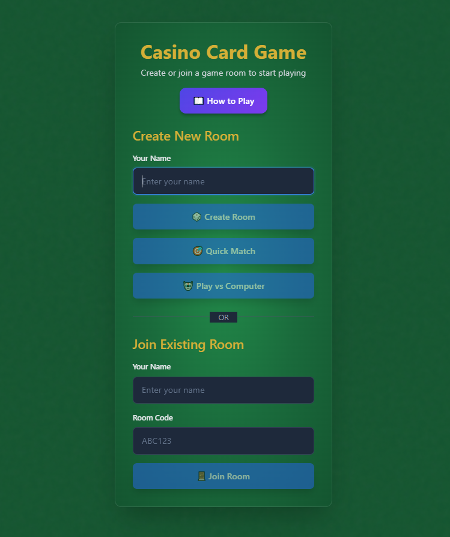

# 🎮 Casino Card Game — Serverless P2P

A peer-to-peer implementation of the classic Casino card game. Two players connect
their browsers **directly** — no server, no accounts — capture cards, build
combinations, and compete for the highest score.

**Live Demo:** https://khasinogaming.com/cassino/

> **Serverless & peer-to-peer.** The entire game engine runs in the browser and
> players connect over a direct WebRTC data channel using copy/paste connection
> codes. The site is a static bundle you can host anywhere — there is **no backend
> to run or pay for**. (The `backend/` FastAPI service is legacy and no longer
> required; see [Architecture](#-architecture).)

[](https://github.com/Malungisa-Mndzebele/cassino-card-game)
[](#-architecture)
[](https://khasinogaming.com/cassino/)

---

## 📸 Game Preview

<p align="center">
  
</p>

<p align="center">
  <em>Create a room, join with friends, or play against the computer!</em>
</p>

---

## 🚀 Quick Start

### Local Development

1. **Install Dependencies**
```bash
npm install
```

2. **Start the app** (that's it — no backend needed)
```bash
npm run dev
# Runs on http://localhost:5173
```

3. **Play the Game** — see [How to play (peer-to-peer)](#-how-to-play-peer-to-peer).

### Build for production
```bash
npm run build      # outputs a static site to build/
```
Deploy the contents of `build/` to any static host (FTP, nginx, S3, GitHub Pages…).

---

## 🎮 How to play (peer-to-peer)

There is no matchmaking server — players connect directly by exchanging two short
codes (via chat, email, or any channel you like):

1. **Player 1** clicks **Host a Game** and copies the **invite code**, then sends it
   to Player 2.
2. **Player 2** clicks **Join a Game**, pastes the invite code, and copies the
   generated **reply code** back to Player 1.
3. **Player 1** pastes the reply code and clicks **Connect**.

The browsers now hold a direct WebRTC connection and the game begins. One browser
(the host) runs the authoritative game engine and keeps both sides in sync.

> **Network note:** connection discovery uses free public **STUN** servers, which
> works on most home/office networks. Very restrictive/symmetric-NAT networks
> (some corporate/mobile) would need a **TURN relay** (a server) to connect — the
> one thing pure copy/paste signaling can't work around.

---

## 🎯 Game Rules

### Objective
Score the most points by capturing cards from the table. First player to 11 points wins!

### Scoring System
- **Aces**: 1 point each (4 total)
- **2 of Spades**: 1 point (Big Casino)
- **10 of Diamonds**: 2 points (Little Casino)
- **Most Cards**: 2 points (27+ cards)
- **Most Spades**: 2 points (7+ spades)

**Maximum possible score per round:** 11 points

### Game Actions

#### 1. Capture 🎯
- Take cards from the table that match your hand card
- Combine multiple cards that sum to your hand card value
- Example: Play 8 to capture 8, or 3+5, or 2+2+4

#### 2. Build 🏗️
- Create combinations for future capture
- Must announce the build value
- Must have a matching card in hand
- **Drag-and-drop support:** Drag a card from your hand to the table to create a simple build
- Example: Play 3 on 5, announce "building 8"

#### 3. Trail 🚶
- Place a card on the table when no capture/build is possible
- Strategic move to set up future plays

---

## 🛠️ Technology Stack

### Frontend (the whole app)
- **SvelteKit** with TypeScript, **Svelte 5** runes
- **Vite** for fast builds, **TailwindCSS** for styling
- **In-browser game engine** (`src/lib/engine/`) — the rules, ported from the
  legacy Python service, run entirely client-side
- **WebRTC data channels** (`src/lib/p2p/`) for direct browser-to-browser play
  with manual (copy/paste) signaling and public STUN

### Testing
- **Vitest** for engine, store, and component tests
- **Playwright** for E2E tests

### Legacy backend (not required)
- **FastAPI** / **SQLAlchemy** / **PostgreSQL** — the original client-server
  implementation, kept in `backend/` for reference. The live game no longer uses
  it.

### Deployment
- **Static build only** — deploy `build/` to any static host (FTP, nginx, S3,
  GitHub Pages…). No server, database, or Redis required.
- **CI/CD**: GitHub Actions (build + FTP deploy)

---

## 📁 Project Structure

```
cassino-card-game/
├── backend/                    # Python FastAPI backend
│   ├── main.py                # Main API server
│   ├── models.py              # Database models
│   ├── game_logic.py          # Game rules engine
│   ├── services/              # Service layer
│   │   ├── room_service.py    # Room management
│   │   ├── game_service.py    # Game actions
│   │   └── player_service.py  # Player operations
│   ├── requirements.txt       # Python dependencies
│   └── test_*.py              # Backend tests
├── src/                        # SvelteKit source
│   ├── routes/                # SvelteKit routes
│   ├── lib/                   # Shared libraries
│   │   ├── components/        # Svelte components
│   │   │   ├── GameBoard.svelte      # Main game board with drag-and-drop
│   │   │   ├── CasinoRoomView.svelte
│   │   │   ├── PokerTableView.svelte
│   │   │   ├── GamePhases.svelte
│   │   │   └── ui/            # Reusable UI components
│   │   └── stores/            # Svelte stores (state management)
│   │       ├── gameStore.ts
│   │       ├── connectionStore.ts
│   │       └── voiceChat.svelte.ts
├── tests/                      # Test suites
│   ├── frontend/              # Component tests (Vitest)
│   ├── e2e/                   # End-to-end tests (Playwright)
│   ├── integration/           # Integration tests
│   └── performance/           # Performance tests
├── .github/workflows/          # CI/CD pipelines
│   ├── ci.yml                 # Test automation
│   ├── deploy-backend.yml     # Backend deployment
│   └── deploy-frontend.yml    # Frontend deployment
├── vite.config.ts             # Vite configuration
├── playwright.config.ts       # E2E test config
└── run-all-tests.ps1          # Comprehensive test runner
```

---

## 🧪 Testing

### Run All Tests
```bash
# Windows
.\run-all-tests.ps1

# Or run individual test suites
npm run test:frontend
npm run test:e2e
npm run test:backend
```

### Frontend Tests
```bash
# Unit tests (Vitest)
npm run test:frontend

# E2E tests (Playwright)
npm run test:e2e

# Specific E2E tests
npm run test:e2e:create-join
npm run test:e2e:random-join
npm run test:e2e:full-game
```

### Backend Tests
```bash
cd backend
python test_api_comprehensive.py
python run_simple_tests.py
```

### Production Tests
```bash
# Test live deployment
npx playwright test tests/e2e/production-smoke-test.spec.ts --config=playwright.production.config.ts
```

### Test Coverage
Tests are organized by category:
- **Frontend**: Vitest component and store tests
- **Backend**: Pytest API and service tests  
- **E2E**: Playwright browser automation tests
- **Integration**: Full-stack integration tests

---

## 🚢 Deployment

The game is a **static site** — build it and drop the output on any static host.
There is no backend, database, or environment configuration to deploy.

### Build
```bash
npm install
npm run build      # outputs to build/
```

### Deploy
Upload the contents of `build/` to your host:

- **FTP / shared hosting** (e.g. khasinogaming.com): `npm run deploy:ftp` (set
  `FTP_HOST` / `FTP_USER` / `FTP_PASSWORD` in `.env`), or upload `build/` manually
  to your web root (e.g. `/public_html/cassino/`).
- **nginx / Apache / S3 / GitHub Pages / Netlify / Vercel**: serve the `build/`
  directory as static files.

The app is served under the `/cassino/` base path in production (configured in
`svelte.config.js`). Change or remove `paths.base` there if you deploy at a
different path.

### CI/CD
`.github/workflows/deploy-frontend.yml` builds the static site and deploys it via
FTP on push to `main`/`master`. No build-time environment variables are required.

### Verify
Open the deployed URL, click **Host a Game**, and complete the copy/paste
handshake with a second browser/device (see
[How to play](#-how-to-play-peer-to-peer)).

---

## ⚙️ Configuration

The app needs **no runtime configuration** — no environment variables, database,
or API endpoint. The only build-time setting is the base path in
`svelte.config.js`:

```js
kit: {
  paths: {
    base: process.env.NODE_ENV === 'production' ? '/cassino' : ''
  }
}
```
Change or remove `paths.base` if you deploy at a different path (or the site root).

STUN servers (used for WebRTC NAT discovery) are configured in
`src/lib/p2p/peer.ts` — they default to Google's free public servers. Add a TURN
server there if you need to support restrictive/symmetric-NAT networks.

---

## 🏗️ Architecture

The game is **fully client-side and peer-to-peer**. One browser (the host) runs
the authoritative game engine; both browsers exchange messages over a direct
WebRTC data channel.

```
 Player 1 (host)                                   Player 2 (guest)
┌───────────────────────────┐                    ┌──────────────────────────┐
│ RoomController (engine)    │   WebRTC data      │ UI + gameStore           │
│  ├─ authoritative state    │◀─── channel ──────▶│  ├─ sends action requests │
│  ├─ applies every action   │   (copy/paste       │  └─ renders broadcast     │
│  └─ broadcasts new state   │    signaling)       │      state                │
└───────────────────────────┘                    └──────────────────────────┘
        gameEngine.ts (pure rules) — capture / build / trail / scoring
```

### Key modules
```
src/lib/
  ├── engine/
  │   ├── gameEngine.ts       # Pure Casino rules (ported from backend/game_logic.py)
  │   └── roomController.ts   # Authoritative game state + action handlers
  ├── p2p/
  │   ├── peer.ts             # WebRTC data channel + manual (copy/paste) signaling
  │   └── session.ts          # Ties peer + engine + gameStore together
  ├── stores/
  │   ├── gameStore.ts        # Reactive game state
  │   └── connectionStore.ts  # Reflects the P2P connection status
  ├── utils/api.ts            # Same action API as before, now routed through the P2P session
  └── components/             # GameBoard, GamePhases, Card, RoomManager (lobby), …
```

- **Host authority:** the host applies every move (its own directly, the guest's
  from a forwarded request) and broadcasts the resulting state, so the two
  browsers can never disagree.
- **No server:** all state lives in memory in the host's tab. Closing it ends the
  game (there is nothing to persist to, and reloading can't restore a peer
  connection).

> The `backend/` FastAPI service is the **legacy** client-server implementation.
> It still runs and its tests pass, but the live game no longer depends on it. The
> browser engine in `src/lib/engine/` is a faithful port of `backend/game_logic.py`.

---

## 🐛 Troubleshooting

### Common Issues

#### Backend won't start
```bash
# Check Python version
python --version  # Should be 3.11+

# Reinstall dependencies
cd backend
pip install -r requirements.txt
```

#### Frontend build errors
```bash
# Clear cache and reinstall
rm -rf node_modules package-lock.json
npm install
```

#### WebSocket connection fails
- Check backend is running on port 8000
- Verify CORS settings in backend
- Check browser console for errors

#### Tests failing
```bash
# Install Playwright browsers
npx playwright install chromium

# Run tests with debug
npm run test:e2e:debug
```

---

## 📚 Documentation

All documentation is organized in the [`docs/`](docs/) directory:

### 🚀 [Deployment Documentation](docs/deployment/)
- **[Deployment guide](#-deployment)** (above) - Self-hosted backend + static frontend
- **[DEPLOYMENT.md](DEPLOYMENT.md)** - Full deployment reference
- **[DEPLOYMENT_SUMMARY.md](docs/deployment/DEPLOYMENT_SUMMARY.md)** - Deployment architecture overview

### 💻 [Development Documentation](docs/development/)
- **[QUICK_START.md](docs/development/QUICK_START.md)** - Get started with development
- **[START_SERVERS.md](docs/development/START_SERVERS.md)** - How to start backend and frontend

### 🧪 [Testing Documentation](docs/testing/)
- **[TESTING_QUICK_GUIDE.md](docs/testing/TESTING_QUICK_GUIDE.md)** - Quick testing reference
- **[TESTING_INSTRUCTIONS_FINAL.md](docs/testing/TESTING_INSTRUCTIONS_FINAL.md)** - Comprehensive testing guide
- **[E2E_TEST_RESULTS.md](docs/testing/E2E_TEST_RESULTS.md)** - End-to-end test results
- **[PRODUCTION_E2E_TEST_RESULTS.md](docs/testing/PRODUCTION_E2E_TEST_RESULTS.md)** - Production test results

### 📋 Additional Resources
- **[Specs](.kiro/specs/)** - Feature specifications and design documents
- **[Steering Rules](.kiro/steering/)** - Development guidelines and conventions

---

## 🤝 Contributing

1. Fork the repository
2. Create a feature branch (`git checkout -b feature/amazing-feature`)
3. Make your changes
4. Run tests (`node run-all-tests.js`)
5. Commit your changes (`git commit -m 'Add amazing feature'`)
6. Push to the branch (`git push origin feature/amazing-feature`)
7. Open a Pull Request

### Development Guidelines
- Write tests for new features
- Follow TypeScript/Python best practices
- Update documentation as needed
- Ensure all tests pass before submitting PR

---

## 📊 Project Stats

- **Lines of Code**: ~20,000+
- **Components**: 30+
- **API Endpoints**: 15+
- **Svelte Stores**: 5+
- **Service Classes**: 3 (Room, Game, Player)
- **Deployment**: Automated CI/CD

---

## 📝 License

MIT License - feel free to use and modify!

---

## 🙏 Acknowledgments

- Classic Casino card game rules
- FastAPI framework
- Svelte and SvelteKit communities

---

## 📞 Support

- **Live Site**: https://khasinogaming.com/cassino/
- **Issues**: [GitHub Issues](https://github.com/Malungisa-Mndzebele/cassino-card-game/issues)

---

**Built with ❤️ for card game enthusiasts**
